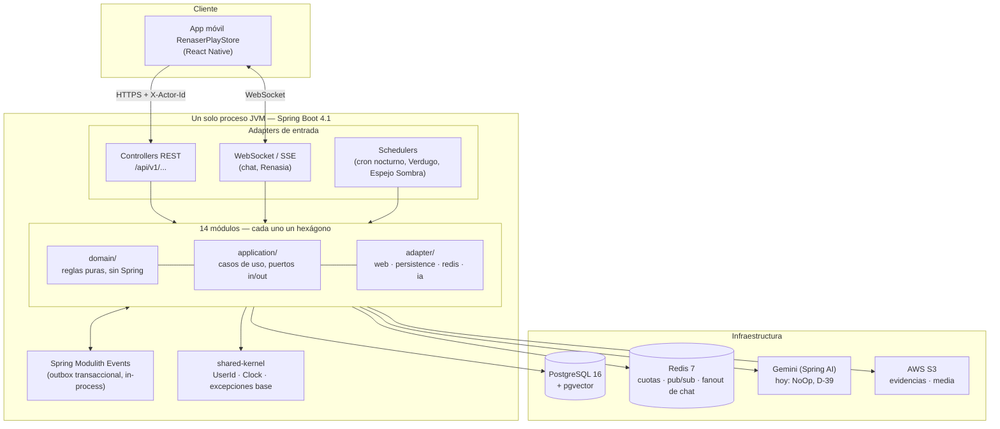
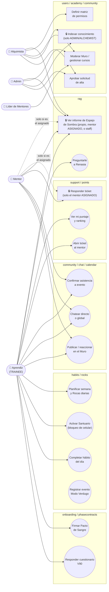
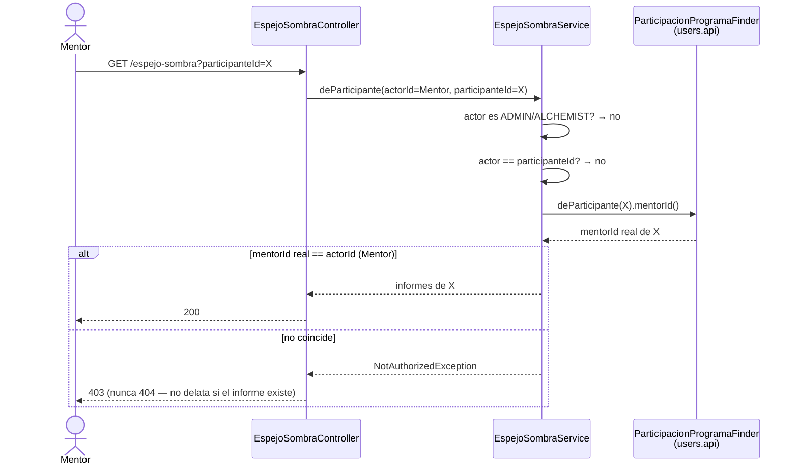

# Renaser OS — Backend

Backend del programa de transformación de 90 días **Renaser OS**, migrado de Next.js/Prisma/Supabase a **Java 25 + Spring Boot 4.1 + Spring Modulith**, consumido por la app móvil **RenaserPlayStore** (React Native). Los 14 módulos del dominio están construidos, auditados y probados de punta a punta contra Postgres/Redis reales.

> Documentos hermanos: [`docs/MODULOS_A_AVANZAR.md`](docs/MODULOS_A_AVANZAR.md) (qué se construyó y en qué orden), [`CLAUDE.md`](CLAUDE.md) (por qué se decidió cada pieza de la arquitectura), [`docs/BITACORA_ERRORES.md`](docs/BITACORA_ERRORES.md) (cada bug real encontrado, su causa y cómo evitarlo), [`docs/CUMPLIMIENTO_REQUISITOS.md`](docs/CUMPLIMIENTO_REQUISITOS.md) (los 45 requisitos del cliente contrastados uno por uno contra lo construido).

---

## 1. Propósito

Renaser es un programa de acompañamiento de 90 días que combina hábitos diarios, metas semanales ("Rocas"), formación (Academia), comunidad, mentoría y un asistente de IA (**Renasia**) que ayuda al aprendiz a reflexionar sobre su propio proceso. El backend expone esa lógica de negocio a la app móvil vía una API REST versionada (`/api/v1/...`), preservando el contrato que la app ya consume.

**Por qué Java/Spring y no seguir en Next.js:** el driver fue rendimiento bajo alta concurrencia I/O-bound (Postgres, Redis, llamadas a IA) con **Virtual Threads** de Java 25, y la posibilidad de imponer límites de arquitectura *verificables en CI* (Spring Modulith + ArchUnit) en un dominio que ya tenía 14 features creciendo sin fricción entre sí. El detalle completo de esa decisión está en `CLAUDE.md`.

**Los 5 roles del sistema:** `TRAINEE` (aprendiz), `MENTOR`, `MENTOR_LEAD` (líder de mentores), `ADMIN` y `ALCHEMIST` (alquimista — el rol de mayor jerarquía).

---

## 2. Arquitectura: monolito modular + hexagonal

**Un solo proceso JVM, 14 módulos, cero microservicios.** La razón no es moda: una llamada entre módulos dentro del mismo proceso cuesta nanosegundos; entre microservicios cuesta milisegundos de red — y varias operaciones de negocio (completar un hábito → sumar puntos → revisar fase → notificar) necesitan ser una única transacción de base de datos, algo gratis en un monolito y costoso (patrón Saga) entre servicios separados. El razonamiento completo, con sus números, está en `CLAUDE.md` §3–§4.

**Spring Modulith** hace cumplir en cada build que un módulo *solo* puede importar el paquete público (`<modulo>.api`) de otro módulo — nunca su dominio, sus casos de uso ni sus adaptadores internos. `ArchitectureTest` rompe el CI si esa regla se viola.



**Dentro de cada módulo** (ejemplo real, `habits/`):

```
habits/
├── package-info.java              (@ApplicationModule)
├── api/                           ← ÚNICO paquete que otros módulos pueden importar
├── domain/model/<agregado>/       ← Java puro: HabitTrack, DayType... sin Spring/JPA
├── application/
│   ├── ports/{in,out}/<agregado>/ ← interfaces (casos de uso / lo que se necesita de afuera)
│   └── services/                  ← implementación de los casos de uso
└── infrastructure/adapter/
    ├── in/rest/<agregado>/        ← @RestController, tonto (CLAUDE.md §5.4.6)
    ├── in/scheduler/              ← @Scheduled
    └── out/persistence/<agregado>/← @Entity JPA + Mapper + Adapter
```

**Autenticación (transitoria):** header `X-Actor-Id: <uuid>`. Se reemplazará por JWT de Supabase (Resource Server) cuando se resuelva la migración de usuarios reales — el diseño de casos de uso no cambia, solo cómo se obtiene el `actorId`.

### Los 14 módulos

| Módulo | Responsabilidad |
|---|---|
| `users` | Identidad, roles, altas de cuenta, perfiles (Aprendiz/Mentor/Admin/Alquimista) |
| `onboarding` | Cuestionario inicial, hitos de aceptación, grabaciones V90 |
| `phasecontracts` | Firma del "Pacto de Sangre" al desbloquearse cada fase del programa |
| `habits` | Catálogo de hábitos, registros diarios, Santuario (bloqueo de celular), racha |
| `rocks` | Plan semanal, rocas diarias, Modo Verdugo (consecuencias por incumplimiento) |
| `evidence` | Validación de evidencia fotográfica/audio subida por el aprendiz |
| `points` | Puntaje, ajustes de liga, ranking |
| `academy` | Catálogo de cursos con gates por día de programa y por rol |
| `community` | Muro social, reacciones, comentarios, células, cohortes |
| `calendar` | Eventos, recurrencia, cola de recordatorios |
| `chat` | Conversaciones directas y globales, tiempo real vía Redis Pub/Sub |
| `notifications` | Bandeja persistida, consumidor de eventos de TODOS los demás módulos |
| `support` | Tickets al mentor asignado y biblioteca de soporte |
| `rag` | Base de conocimiento (RAG), chat con **Renasia**, informes de Espejo de Sombra |

---

## 3. Casos de uso principales

Los cinco roles interactúan con subconjuntos distintos del sistema. Los casos marcados con 🔒 tienen una regla de autorización no trivial (no alcanza con el rol: hace falta además una relación — "sos *el* mentor asignado", no cualquier mentor).



**Por qué el 🔒 importa:** en esta misma sesión de desarrollo, tres bugs reales de seguridad tuvieron exactamente esta forma — un servicio verificaba *que el actor tuviera el rol MENTOR*, pero nunca *que fuera el mentor asignado a ese aprendiz en particular* (`support`, tickets), o directamente no chequeaba nada (`community`, reacciones/comentarios con cuenta suspendida). El patrón correcto (`EspejoSombraService.requireVisibilidad`, `TicketMentorService.requireMentorAsignado`) resuelve el mentor real vía `users.api.ParticipacionProgramaFinder.mentorId()` y lo compara contra el actor — nunca alcanza con `rol == MENTOR`. Detalle completo en `docs/BITACORA_ERRORES.md` (E-38, E-42).

---

## 4. Cómo funciona el RAG (módulo `rag`, submódulo Renasia)

`rag` tiene tres piezas que trabajan juntas pero se pueden entender por separado:

1. **`conocimiento`** — una base de conocimiento indexada por embeddings en **pgvector** (columna `base_conocimiento.embedding vector(768)`, índice HNSW coseno). Solo ADMIN/ALCHEMIST pueden indexar contenido nuevo.
2. **`conversacion` (Renasia)** — el chat de IA del aprendiz, con streaming de respuesta y un límite diario de mensajes (cuota en Redis).
3. **`espejosombra`** — un informe semanal generado por IA a partir del diario del aprendiz (lee `habits.api.EntradaDiarioFinder`), visible solo para el propio aprendiz, su mentor **asignado**, o staff.

### Secuencia real: el aprendiz le pregunta algo a Renasia

```mermaid
sequenceDiagram
    autonumber
    actor A as Aprendiz (app móvil)
    participant C as RenasiaController
    participant S as ConversacionRenasiaService
    participant U as UserSummaryFinder (users.api)
    participant R as Redis<br/>(ControlCuotaRenasiaPort)
    participant DB as Postgres<br/>(Conversacion/Mensaje)
    participant V as pgvector<br/>(VectorStorePort)
    participant IA as Gemini / Spring AI<br/>(ChatIAPort — hoy NoOp, D-39)

    A->>C: POST /api/v1/renasia/mensajes<br/>{question} + X-Actor-Id
    C->>S: preguntar(actorId, question)

    Note over S: Todo esto es SÍNCRONO,<br/>dentro de la misma @Transactional

    S->>U: findById(actorId)
    U-->>S: activo? suspendido? no existe?
    alt actor no existe o suspendido
        S-->>C: excepción (404 / 403)
        C-->>A: error, sin stacktrace
    end

    S->>R: INCR renasia:cuota:{actor}:{hoy}
    R-->>S: contador
    alt contador > 25 (D-48)
        S-->>C: RateLimitExceededException
        C-->>A: 429 "límite diario alcanzado"
    end

    S->>DB: buscar o crear Conversacion(actorId)
    S->>DB: guardar Mensaje(rol=USUARIO, contenido)

    S->>V: buscarSimilares(question, topK=5)
    V-->>S: fragmentos relevantes (contexto)

    Note over S,IA: Acá termina la transacción síncrona:<br/>se devuelve el Flux SIN suscribirse todavía

    S-->>C: Flux&lt;String&gt;
    C-->>A: 200, Content-Type: text/event-stream

    IA-)C: emite tokens de a poco (streaming)
    C--)A: data: ...chunk 1...
    C--)A: data: ...chunk 2...

    alt el stream termina bien (onComplete)
        C->>S: doOnComplete
        S->>DB: guardar Mensaje(rol=ASISTENTE, contenido completo, fuentes)
    else el stream falla (onError)
        C->>S: doOnError
        S->>R: DECR cuota (liberar() — no cobrar un mensaje que no llegó a responder)
    end
```

**Por qué el orden importa (y por qué se corrigió una vez):** la cuota se descuenta en Redis *antes* de saber si la IA va a responder, porque el chequeo de cuota tiene que pasar antes de gastar cómputo en buscar contexto y llamar al modelo. Eso significa que un fallo posterior (pgvector caído, Gemini con timeout) le cobraría un mensaje al aprendiz sin darle nada a cambio — por eso el flujo libera la cuota (`ControlCuotaRenasiaPort.liberar`) tanto si falla la búsqueda de contexto como si el streaming termina en error. Es uno de los hallazgos reales de la auditoría adversarial de esta sesión (`docs/BITACORA_ERRORES.md`, E-41).

**Por qué la transacción se corta donde se corta:** `@Transactional` sobre un método que devuelve un `Flux` solo envuelve la parte **síncrona** — Spring cierra la transacción JDBC apenas el método `retorna` el `Flux`, no cuando termina de emitir. Por eso "guardar la pregunta del usuario" es atómico con "verificar cuota y crear la conversación", pero "guardar la respuesta del asistente" ocurre en su propia transacción implícita, después, cuando el stream ya terminó.

### El Espejo de Sombra: quién puede verlo



---

## 5. Stack tecnológico

| Pieza | Elección |
|---|---|
| Lenguaje / runtime | Java 25 (LTS), Virtual Threads |
| Framework | Spring Boot 4.1.1 + Spring Modulith 2.1.0 |
| Persistencia | PostgreSQL 16 + Flyway (baseline de 90 tablas, esquema `renaser`) |
| Vectores (RAG) | `pgvector` sobre el mismo Postgres — SQL nativo propio (D-45), no el `PgVectorStore` genérico de Spring AI |
| Caché / cuotas / fanout | Redis 7 |
| IA | Spring AI 2.0 sobre Gemini — hoy adaptadores `NoOp` (sin credenciales, D-39) |
| Storage de archivos | AWS S3 (URLs prefirmadas) |
| Build | Maven (`mvnw`) |
| Tests | JUnit 5, Testcontainers (Postgres + Redis reales), ArchUnit / Spring Modulith test |
| Mapeo | MapStruct (solo JPA↔dominio), a mano en la frontera HTTP (blindaje anti mass-assignment) |

## 6. Cómo correrlo

```bash
docker compose up -d              # Postgres + pgvector, Redis
./mvnw clean test                 # gate completo — debe quedar en verde
./mvnw spring-boot:run            # levanta en :8080
```

Variables de entorno relevantes (ver `src/main/resources/application.yaml`): `DB_URL`/`DB_USERNAME`/`DB_PASSWORD`, `REDIS_HOST`/`REDIS_PORT`, `SUPABASE_JWKS_URL`, `GOOGLE_GENAI_API_KEY` (opcional — sin ella, `rag`/`evidence`/`onboarding` usan adaptadores NoOp sin romper nada), `AWS_S3_BUCKET`/`AWS_REGION`, `CORS_ORIGENES`, `RENASIA_LIMITE_DIARIO`.

## 7. Estado actual

Los 14 módulos están construidos, con `./mvnw clean test` en verde (1112 tests), auditados por agentes adversariales (seguridad, concurrencia, invariantes de dominio, límites de Modulith) y probados de punta a punta contra la app real — ver `docs/BITACORA_ERRORES.md` y `docs/PRUEBAS_ENDPOINTS_RAG.md`. Preguntas de negocio abiertas, pendientes de decisión del producto (no inventadas por diseño, CLAUDE.md §0.6): `docs/MODULO_ONBOARDING.md` (Q-O1) y `docs/MODULO_POINTS.md` (Q-6).
