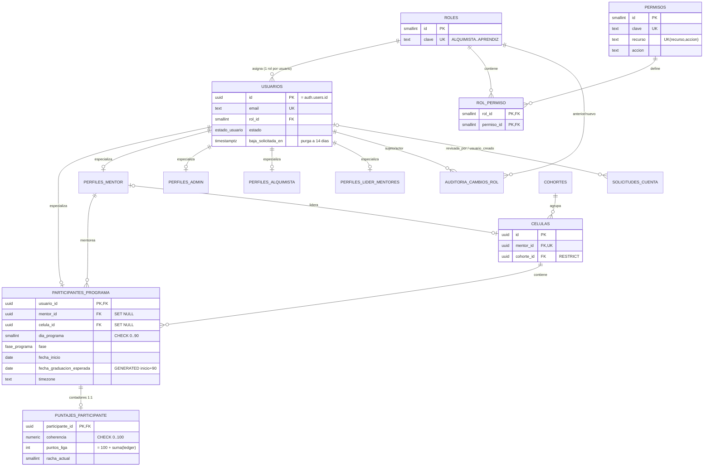
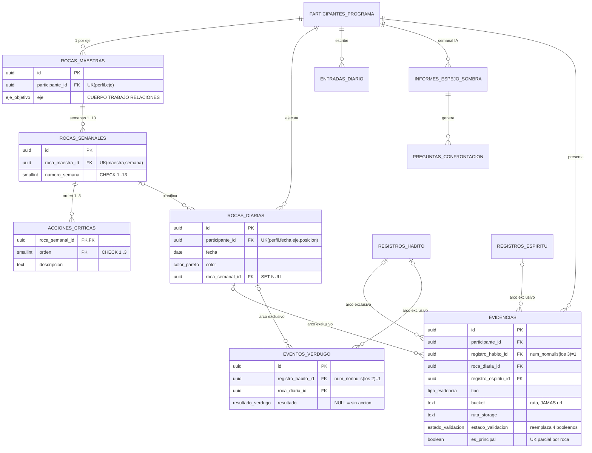
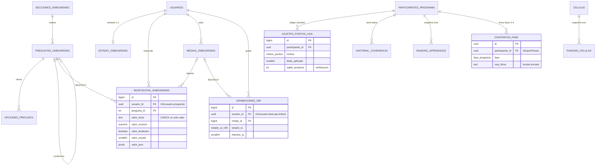

# Auditoría y rediseño de la base de datos — Renaser OS

**Fecha:** 2026-08-24 · **Estado:** propuesta v1, pendiente de aprobación de Luis/Ricardo
**Insumos:** `prisma/schema.prisma` real (69 modelos, 42 enums), migraciones SQL del repo móvil (8 tablas de Academia), análisis de hot paths de backend y app ([`ANALISIS_BD_ANTIGUA.md`](ANALISIS_BD_ANTIGUA.md)), diagrama [`ER_BD_ANTIGUA.drawio`](ER_BD_ANTIGUA.drawio).
**Alcance:** auditoría del modelo actual → modelo conceptual → modelo lógico → normalización 1FN–5FN → integridad → RBAC → seguridad PostgreSQL → índices → comparación → diagrama ER → DDL final ([`sql/BD_NUEVA_V1.sql`](sql/BD_NUEVA_V1.sql)).
**Convención acordada:** tablas y columnas de la BD nueva **en español**, `snake_case`. La equivalencia con los nombres actuales está en §11.

> **Estado 2026-08-24 (posterior):** este documento es el **diseño de referencia** (93 tablas). La **fuente operativa** es `src/main/resources/db/migration/V1__baseline_renaser.sql` (**90 tablas**): el módulo `users` en Java aplicó D-21 (RBAC como enum Java — `usuarios.rol`; las tablas `roles`/`permisos`/`rol_permiso` quedan creadas pero [SUPERADO] hasta ajustar `roles_permitidos_curso`/`roles_destino_evento` en academy/calendar) y D-25 (perfiles alquimista/admin fusionados en `usuarios.bio`/`departamento`; `perfiles_lider_mentores` diferido). Ver `docs/MODULO_USERS.md` §7 y D-33. El diagrama `ER_BD_NUEVA.drawio` se genera **del baseline**, no de este DDL.
>
> **Regla que gobierna todo el documento:** no se inventan reglas de negocio. Todo lo propuesto sale de lo que el schema y el código actual ya hacen. Donde el negocio no está confirmado, se marca **[PENDIENTE-CONFIRMAR]** — hay 7 de esos, listados al final de §15.

---

# 1. Diagnóstico de la base de datos actual

## 1.1 Visión general

La BD actual funciona — sostiene una app en producción — pero su **integridad depende del código de aplicación, no del motor**. Ese es el diagnóstico raíz del que se derivan casi todos los problemas concretos:

1. **Dos esquemas paralelos sin FKs entre sí.** Prisma gobierna 69 tablas; el dominio Academia (`cursos`, `lecciones`, `leccion_progreso`, `grupos`…) vive en 8 tablas creadas por migraciones del repo **de la app móvil**, invisible para Prisma. Consecuencia medible: `academia_recommendations` copia `leccion_titulo`/`curso_titulo` porque no puede hacer JOIN, `calendar_events.course_id` es un texto suelto, y `renasia_messages.source_lesson_ids` es un array de ids sin FK.
2. **Relaciones polimórficas sin FK.** `evidence` y `enforcer_events` apuntan a 4 y 2 tablas distintas mediante el par (`related_entity_type`, `related_entity_id`). Postgres no puede garantizar que esos ids existan, no hay CASCADE, y cada lectura es un join manual `IN (...)`. Hay evidencia huérfana *posible por diseño*.
3. **Autorización sin modelo de datos.** `users.role` es un enum de 5 valores y la matriz de permisos vive hardcodeada en el código. No existen tablas `roles`/`permisos`: agregar un rol es `ALTER TYPE` + deploy coordinado (pasó con `MENTOR_LEAD`, que además quedó **sin tabla de perfil**). Es el hallazgo que motivó esta auditoría y se resuelve en §8 con RBAC adaptado al negocio real.
4. **CASCADE peligrosos desde catálogos.** `habits → habit_tracks` es `ON DELETE CASCADE`: borrar un hábito del catálogo **borra el historial de todos los aprendices** (y deja los puntos ya otorgados sin respaldo). Lo mismo `habit_schedules`, `trainee_habit_unlocks`, etc.
5. **Tipos débiles para un dominio sensible al tiempo.** Todo `DateTime` de Prisma es `timestamp(3)` **sin zona horaria**, en un negocio donde cada aprendiz tiene su `timezone` y las ventanas horarias otorgan o quitan puntos. Las horas (`trigger_time`, `limit_time`) son `text "HH:mm"`, y hay fechas guardadas como `String` (`academia_recommendations.date`, `shadow_mirror_reports.week_start`).
6. **Redundancia estructural.** Dos sistemas de hábitos casi idénticos (catálogo vs personales) con las mismas columnas duplicadas — incluido el grupo `pending_*` de cambios de horario programados, replicado campo por campo en dos tablas. Un bug corregido en uno debe corregirse dos veces.
7. **Contadores sin libro mayor.** `coherence_score` se sobrescribe cada noche sin historial; `league_points` sí tiene bitácora (`league_point_adjustments`) pero el UPDATE del saldo y el INSERT del asiento van **fuera de transacción** (el asiento puede perderse y el saldo divergir); `total_trainees_managed` es un contador manual de algo que se deriva con un COUNT.
8. **El plano de escritura está partido en dos.** La app móvil escribe directo a Postgres vía RLS (onboarding completo, radar, progreso de lecciones, testimonios) mientras el backend escribe vía Prisma con service-role key **que ignora RLS**. Dos contratos de escritura distintos sobre las mismas tablas, y una sola credencial todopoderosa del lado del servidor.
9. **Producción ≠ repositorio.** ~37 scripts SQL aplicados a mano fuera de `prisma migrate` (tablas enteras como `habit_guides` no tienen migración). Cualquier rediseño debe partir de `information_schema` de producción, no del repo.

**Lo que está bien y el rediseño conserva** (auditar no es demoler): las claves únicas de negocio que dan idempotencia a los crons (`(aprendiz, hábito, fecha)`, `(aprendiz, fase)`, `(roca_maestra, semana)`); la paginación keyset de muro y chat con sus índices; la idempotencia atómica de puntos (`updateMany` con guarda `awarded_points = 0`); el patrón async+polling de validación IA; la separación rol/perfil en tablas 1:1 (no herencia con discriminador); el patrón correcto de storage en `habit_guide_attachments` (guardar **ruta**, firmar al leer) — que el rediseño generaliza a todas las tablas con archivos; y el catálogo `wall_categories`, que es exactamente el patrón que §5 aplica a las demás listas volátiles.

## 1.2 Auditoría tabla por tabla (resumen ejecutivo por dominio)

Veredictos: **✔ conservar** (con ajustes de tipo/índice) · **✎ corregir** (cambio estructural) · **⇄ fusionar** · **✂ dividir** · **✚ falta** (tabla nueva) · **✖ eliminar**.

### Identidad y acceso

| Tabla actual | PK | Problemas detectados | Veredicto |
|---|---|---|---|
| `users` | uuid (=auth) | `role` enum sin tabla (P-07); mezcla identidad + estado + baja; `timestamp` sin TZ; índice `(role)` redundante con `(role,status)` | ✎ → `usuarios` + FK `rol_id` |
| `account_requests` | uuid | `reviewed_by_id` sin FK (P-09); sin enlace a `users` tras aprobar; `request_ip` como text | ✎ → `solicitudes_cuenta` con FK `SET NULL` |
| `alchemist_profiles` / `admin_profiles` | uuid | Surrogate `id` + `user_id UNIQUE` para una relación 1:1 → la PK natural es `user_id` (regla 4-5 del encargo) | ✎ PK = `usuario_id` |
| `mentor_profiles` | uuid | Ídem 1:1; `total_trainees_managed` derivable (anomalía de actualización); `league_points` sin ledger | ✎ |
| `trainee_profiles` | uuid | 23 columnas: mezcla identidad de programa + contadores volátiles (score/puntos/rachas se reescriben a diario sobre la misma fila caliente); `expected_graduation_date` derivable (= inicio+90); ídem 1:1 | ✂ → `participantes_programa` + `puntajes_participante` |
| `role_change_audits` | uuid | Guarda roles como **enum copiado** (si el enum cambia, el histórico miente); FKs `SET NULL` correctos | ✎ FKs a `roles` |
| *(no existe)* | — | Rol `MENTOR_LEAD` sin tabla de perfil — inconsistencia rol↔perfil | ✚ `perfiles_lider_mentores` |
| *(no existen)* | — | Sin `roles`, `permisos`, `rol_permiso` — matriz de autorización invisible para la BD | ✚ RBAC (§8) |

### Hábitos (núcleo operativo — 17 tablas hoy)

| Tabla actual | Problemas | Veredicto |
|---|---|---|
| `habits` | **0 índices** pese a ser hot path; `is_blocking` muerta (documentado); `category`/`icon_name` como enums de Postgres con historial de dolor (2 limpiezas por SQL manual, riesgo "valor desconocido revienta el cliente"); horas default como text | ✎ + catálogos `categorias_habito`, `iconos_habito` |
| `habit_schedules` | **0 índices** (la consulta el cron de medianoche decenas de veces); rango de días sin CHECK | ✎ |
| `habit_tracks` | Correcta en esencia (UNIQUE de negocio, buenos índices); FK a `habits` **CASCADE = borra historial**; `execution_date` timestamp naive en vez de `date` | ✎ FK `RESTRICT`, tipo `date` |
| `trainee_habit_preferences` | Grupo repetido `pending_*` (4 columnas cuyo significado depende de otra — `pending_effective_date`); un cambio programado es una **entidad**, no 4 columnas anulables | ✂ → `cambios_horario_pendientes` |
| `personal_habits` | **Duplica** el catálogo: mismas máquinas de estado, mismo grupo `pending_*`, mismos weekly days; su evidencia obligó a agregar un valor más al polimorfismo de `evidence` | ⇄ fusionar en `habitos` con `ambito` |
| `personal_habit_tracks` / `personal_habit_weekly_days` | Duplican `habit_tracks` / `trainee_weekly_habit_days` | ⇄ fusionar |
| `personal_habit_edit_log` | **Sin ninguna FK** (ids sueltos) | ⇄ fusionar en `historial_cambios_horario` con FKs |
| `trainee_habit_unlocks`, `trainee_weekly_habit_days`, `trainee_habit_renames`, `habit_preference_changes` | Estructura correcta; surrogate innecesario donde la clave natural es compuesta; falta FK en el log | ✎ PKs naturales |
| `habit_guides` / `habit_guide_attachments` | Bien diseñadas (el patrón ruta-no-URL nace acá); CHECK de coherencia LINK/archivo solo implícito | ✔ + CHECK |
| `block_sessions` | 1:1 con track vía `habit_track_id UNIQUE` → PK natural; `trainee_profile_id` redundante (derivable vía track) | ✎ |
| `phone_free_runs` | `trainee_profile_id` **se conserva a propósito**: la racha cruza medianoche y la búsqueda operativa es "racha viva del aprendiz" (el propio código lo documenta) — redundancia justificada con índice parcial | ✔ |
| `phone_free_weekly_reviews` | Clave natural `(aprendiz, semana)` con surrogate encima | ✎ |
| `radar_entries` | 3 índices con solapamiento (`(userId)` ⊂ `(userId, createdAt DESC)`); FK a `users` cuando conceptualmente es actividad del aprendiz | ✎ |
| `spirit_tracks` / `spirit_audios` | Join lógico por `day` **sin FK**; `spirit_audios.day UNIQUE` ya es clave natural | ✎ FK real sobre `dia` |
| `audio_therapies` | `week UNIQUE` clave natural con surrogate encima | ✎ |

### Rocas, diario y evidencia

| Tabla actual | Problemas | Veredicto |
|---|---|---|
| `master_rocks` | `goal_axis` texto libre (los valores válidos viven en TS — la BD acepta cualquier cosa) | ✎ enum `eje_objetivo` |
| `weekly_rocks` | `critical_action_1/2/3` — **violación 1FN de libro** (grupo repetido); mezcla planificación + revisión (aceptable: mismo sujeto, distinta fase temporal) | ✂ → `acciones_criticas` |
| `daily_rocks` | `primary_evidence_id` crea **FK circular** con `evidence`; `goal_axis` texto libre; UNIQUE de negocio correcto | ✎ flag `es_principal` en evidencias |
| `enforcer_events` | Polimórfica sin FK y sin usar siquiera el enum (`related_entity_type` es `String`) | ✎ arco exclusivo con FKs |
| `journal_entries` | Correcta (UNIQUE `(aprendiz, fecha, tipo)`); `audio_url` debería ser ruta | ✔ |
| `shadow_mirror_reports` | `week_start` como `String`; `confrontation_questions` **Json que es una lista relacional** (regla 10); porcentajes sin CHECK de suma | ✂ → `preguntas_confrontacion` |
| `evidence` | **El problema más grave del modelo** (P-01): polimórfica sin FK; `file_url` guarda URL pública de un bucket **privado** (bug documentado: URLs 403); 4 booleanos de validación IA que codifican una máquina de estados a mano; sin CHECK media-o-texto | ✎ rediseño completo |

### Onboarding

| Tabla actual | Problemas | Veredicto |
|---|---|---|
| `onboarding_state` | PK = `user_id` correcto (1:1); `flow_progress` jsonb opaco que los listados de admin transportan entero | ✔ (jsonb justificado — estado de reanudación de UI, no se consulta relacionalmente) |
| `onboarding_sections` / `onboarding_questions` | `(flow, section_key)` repetido en preguntas en vez de FK a secciones (dependencia transitiva); `options` Json que es una lista | ✎ + `opciones_pregunta` |
| `onboarding_answers` | Copia `flow`, `section_key`, `question_type` desde la pregunta (3FN); `media_id` **sin FK**; EAV tipado de 5 columnas de valor — aceptable para cuestionario dinámico, pero sin CHECK de exclusividad | ✎ FK a pregunta + CHECK |
| `onboarding_media` | Correcta; falta índice del camino de borrado `(user, flow)` | ✔ |
| `variables_90_recordings` | `audio_url` redundante con `media_id`; estados IA como `String` libre | ✎ |

### Comunidad, calendario, chat, notificaciones

| Tabla actual | Problemas | Veredicto |
|---|---|---|
| `cohorts` / `cells` | `cells` mezcla organización + resultados de ranking (`coherence_score_group`, `ranking_position` se sobrescriben sin historial); `cohort_id CASCADE` borra células con aprendices dentro | ✂ ranking → snapshots; FK `RESTRICT` |
| `wall_categories` | **Modelo correcto** — es el patrón catálogo a imitar | ✔ |
| `wall_posts` | `media_url`/`media_mime` legacy conviven con `wall_post_media` (dos formas de lo mismo) | ✎ eliminar legacy |
| `wall_reactions` | Surrogate + `UNIQUE(post,user)` → la PK **es** `(post, user)` | ✎ |
| `wall_comments` | Correcta | ✔ |
| `testimonios` | `wall_post_id` sin FK; `estrellas` sin CHECK; nomenclatura ya en español (única) | ✎ |
| `membership_levels` | Correcta (catálogo chico) | ✔ |
| `calendar_events` | **27 columnas**: evento + recurrencia + arrays (`target_roles enum[]`, `recurrence_by_weekday int[]`) + `reminder_rules Json` + `course_id` sin FK + `created_by CASCADE` (borrar un admin borra eventos institucionales) | ✂ en 5 tablas |
| `event_*` (overrides, rsvps, reminders) | Claves naturales compuestas correctas con surrogates encima; falta índice parcial para el cron de 5 min | ✎ |
| `conversations` | Sin índice en `type`; invariantes por tipo (célula/global/directa) sin CHECK; nada impide dos GLOBAL | ✎ CHECKs + unique parcial |
| `conversation_participants` / `messages` | Correctas en esencia; `messages` media inline (0..1 por mensaje — aceptable); sin CHECK texto-o-media; retención inexistente para el chat global | ✔ + CHECK |
| `welcome_messages` | 1:1:1 legítima (marca "el mensaje de bienvenida de X") — PK natural = destinatario | ✎ PK natural |
| `notifications` / `push_tokens` / `notification_preferences` | Correctas; falta retención; `platform` texto libre | ✔ + CHECK |

### RenasIA, soporte, puntos, contratos, Academia

| Tabla actual | Problemas | Veredicto |
|---|---|---|
| `knowledge_base` | Se filtra por `metadata->>'kind'` y `->>'documentId'` **sin índice** (atributos consultados = columnas, regla 10); índice vectorial vive fuera del schema | ✎ promover columnas |
| `renasia_conversations` | 1:1 con user (`UNIQUE(userId)`) con surrogate encima | ✎ PK = usuario |
| `renasia_messages` | `source_lesson_ids String[]` — multivaluado sin FK (1FN/4FN) | ✂ → `fuentes_mensaje_renasia` |
| `mentor_tickets` / `support_tickets` | Correctas; estados y categorías OK como enums | ✔ |
| `league_point_adjustments` | Correcto como ledger; el **saldo** vive en otra tabla sin transacción común (fix de aplicación, §7) | ✔ |
| *(no existe)* | `coherence_score` sin historial — imposible auditar por qué bajó | ✚ `historial_coherencia` |
| *(no existe)* | Ranking general se calcula full-scan por request | ✚ `ranking_aprendices` / `ranking_celulas` (snapshots del cron) |
| `phase_contracts` | Correcta; `signature_url` debería ser ruta | ✔ |
| `academia_recommendations` | `leccion_titulo`/`curso_titulo` denormalizados (3FN) y `curso_id` transitivo vía lección — existían solo porque no había FK posible | ✎ FK real + eliminar copias |
| `cursos` | `roles_permitidos text[]` — multivaluado que además duplica el concepto rol fuera de RBAC; `acceso` como text+CHECK (bien) | ✂ → `roles_permitidos_curso` FK a `roles` |
| `curso_secciones`, `lecciones`, `leccion_recursos` | Correctas (FKs reales, `SET NULL` sensato en sección); ids `text` de Skool = clave natural externa legítima | ✔ |
| `grupos`, `grupo_miembros`, `leccion_progreso` | **Bien modeladas** — PKs compuestas naturales, sin surrogates. Irónico: las tablas hechas "a mano" en SQL están mejor normalizadas que varias de Prisma | ✔ |
| `curso_asignaciones` | `CHECK num_nonnulls(user_id, grupo_id) = 1` — **arco exclusivo correcto**, el mismo patrón que §5 aplica a `evidencias` | ✔ |

---

# 2. Problemas encontrados

Severidad: **CRÍTICO** = compromete integridad/seguridad de datos hoy · **IMPORTANTE** = deuda estructural con anomalías concretas · **MEJORA** = calidad/mantenibilidad.

| ID | Severidad | Tabla/Relación | Problema | Impacto | Solución |
|----|-----------|----------------|----------|---------|----------|
| P-01 | CRÍTICO | `evidence` → 4 tablas | Relación polimórfica (`related_entity_type`+`related_entity_id`) sin FK | Evidencia huérfana posible; sin CASCADE; joins manuales; el motor no garantiza nada | Arco exclusivo: 3 FKs anulables + `CHECK num_nonnulls()=1` (§5, `evidencias`) |
| P-02 | CRÍTICO | `habits`→`habit_tracks` (y schedules, unlocks…) | `ON DELETE CASCADE` desde el **catálogo** hacia el **historial** | Borrar un hábito del panel elimina el historial y el sustento de puntos ya otorgados de todo el padrón | FK `ON DELETE RESTRICT` + baja lógica (`activo=false`) |
| P-03 | CRÍTICO | `evidence.file_url` (y `phase_contracts.signature_url`, `journal.audio_url`) | Se persiste `getPublicUrl()` de buckets **privados** — URLs que responden 403 (bug ya documentado por el equipo) | Evidencia inservible sin re-firmado manual; inconsistencia entre tablas | Persistir `bucket` + `ruta_storage`, firmar al leer (patrón de `habit_guide_attachments`) |
| P-04 | CRÍTICO | `users.role` | Rol como enum + matriz de permisos solo en código; sin `roles`/`permisos`/`rol_permiso`; `MENTOR_LEAD` sin perfil | Agregar rol = ALTER TYPE + caza manual de checks; la BD no puede responder "¿quién puede qué?"; histórico de auditoría copia enums | RBAC en BD adaptado al negocio (§8): `roles`, `permisos`, `rol_permiso`, `usuarios.rol_id` |
| P-05 | CRÍTICO | Todo el modelo | `timestamp` sin zona + horas `text "HH:mm"` + fechas `String` en un dominio multi-timezone donde las ventanas horarias dan/quitan puntos | Bugs de TZ latentes; comparaciones de texto; imposible usar aritmética temporal del motor | `timestamptz`, `time`, `date` en todo el modelo nuevo |
| P-06 | CRÍTICO | `trainee_profiles.league_points` ↔ `league_point_adjustments` | Saldo (UPDATE crudo) y asiento (INSERT) sin transacción común; el asiento se descarta con `console.warn` si falla | El saldo puede divergir de su libro mayor sin rastro | Invariante saldo=Σ(ledger); ambos en una transacción (app); `saldo_posterior` verificable (§7) |
| P-07 | CRÍTICO | App móvil → Postgres | Escritura directa vía RLS (onboarding, radar, `leccion_progreso`, testimonios) en paralelo al backend con service-role que **ignora RLS** | Dos contratos de escritura; reglas de negocio evitables; una credencial todopoderosa | Un solo plano de escritura (API Java); RLS solo como transición/defensa (§9) |
| P-08 | CRÍTICO | `enforcer_events` | Polimórfica sin FK y `related_entity_type` ni siquiera usa el enum | Ids huérfanos silenciosos | Arco exclusivo con FKs (§5) |
| P-09 | IMPORTANTE | `account_requests.reviewed_by_id`, `testimonios.wall_post_id`, `personal_habit_edit_log.*`, `onboarding_answers.media_id` | Columnas-referencia **sin FK** | Huérfanos; el "sobrevivir al borrado" se lograba renunciando a integridad | FK con `ON DELETE SET NULL` (mismo objetivo, con integridad) |
| P-10 | IMPORTANTE | `weekly_rocks` | `critical_action_1/2/3` — grupo repetido (1FN) | Imposible "acción 4" sin ALTER; queries por acción imposibles | Tabla `acciones_criticas(roca, orden 1..3)` |
| P-11 | IMPORTANTE | `calendar_events` | 27 columnas: arrays `target_roles`/`recurrence_by_weekday`, Json `reminder_rules`, recurrencia inline, `course_id` sin FK | 1FN/4FN violadas; evento simple carga 10 columnas NULL de recurrencia | Dividir: `eventos` + `recurrencias_evento` + `dias_semana_recurrencia` + `roles_destino_evento` + `reglas_recordatorio_evento`; FK real a `cursos` |
| P-12 | IMPORTANTE | `personal_habits` + 3 tablas satélite | Sistema paralelo que duplica estructura del catálogo (incluido el grupo `pending_*` copiado columna a columna) | Doble mantenimiento; obligó a extender el polimorfismo de `evidence` | Unificar en `habitos` con `ambito` ('SISTEMA'/'PERSONAL') + CHECK de coherencia |
| P-13 | IMPORTANTE | `trainee_habit_preferences.pending_*` | 4 columnas anulables cuyo significado depende de `pending_effective_date` (semántica "null significa dos cosas" documentada en el propio schema) | Anomalías de interpretación; updates parciales inconsistentes | Entidad propia: `cambios_horario_pendientes` (0..1 por preferencia) |
| P-14 | IMPORTANTE | `evidence` (validación IA) | 4 booleanos (`validated_by_ai`, `ai_valid`, `ai_penalty_applied`, `ai_overridden_by_admin`) codifican una máquina de estados | Estados imposibles representables (validada e invalidada a la vez) | `estado_validacion` enum + `intentos_ia` + CHECK |
| P-15 | IMPORTANTE | `habit_schedules`, `habits` | **Cero índices** en las tablas del hot path (cron de medianoche + endpoint más llamado, cada 30 s por dispositivo) | Full scans repetidos; el cuello documentado de conexiones | Índices §10: `(habito_id, dia_inicio)`, parciales por `activo` |
| P-16 | IMPORTANTE | `trainee_profiles` | Mezcla identidad de programa con contadores reescritos a diario (`coherence_score`, `league_points`, rachas) — fila caliente, 30+ relaciones cuelgan de ella | Bloat/contención sobre la tabla hub; sin historial de coherencia | `puntajes_participante` 1:1 (fila volátil aparte) + `historial_coherencia` |
| P-17 | IMPORTANTE | `mentor_profiles.total_trainees_managed` | Contador manual de un valor derivable (`COUNT` sobre FK indexada) | Anomalía de actualización (drift comprobado en sistemas así) | Eliminar; derivar. `league_points` de mentor conserva pendiente su ledger **[PENDIENTE-CONFIRMAR]** |
| P-18 | IMPORTANTE | `cells.coherence_score_group`, `ranking_position` | Resultados de ranking sobrescritos sin historial; ranking general full-scan por request (`general_ranking_scores()`) | No auditable; el endpoint más caro del sistema | Snapshots del cron: `ranking_aprendices`, `ranking_celulas`; columnas eliminadas |
| P-19 | IMPORTANTE | `academia_recommendations` | `leccion_titulo`/`curso_titulo` copiados y `curso_id` transitivo vía lección (3FN) — parche por la falta de FK cruzada | Títulos desactualizables; redundancia | Al unificar esquemas: FK real a `lecciones`, columnas copiadas eliminadas |
| P-20 | IMPORTANTE | `renasia_messages.source_lesson_ids`, `cursos.roles_permitidos` | Arrays multivaluados sin FK (1FN/4FN) | Sin integridad; joins imposibles | `fuentes_mensaje_renasia`, `roles_permitidos_curso` (FK a `roles` — sinergia con RBAC) |
| P-21 | IMPORTANTE | `shadow_mirror_reports` | `confrontation_questions` Json que es una lista; `week_start String`; porcentajes sin CHECK | Regla 10 del encargo; tipos débiles | `preguntas_confrontacion(informe, orden)`; `date`; `CHECK suma=100` |
| P-22 | IMPORTANTE | `daily_rocks.primary_evidence_id` ↔ `evidence` | FK circular entre las dos tablas | Orden de inserción/borrado frágil; dump/restore complicado | `evidencias.es_principal` + índice único parcial por roca |
| P-23 | IMPORTANTE | Enums volátiles (`HabitCategory`, `HabitIcon`) | Historial real de dolor: 2 limpiezas por SQL manual; "una fila con un valor que el cliente no conoce revienta al leerse" (cita del schema) | Cambios de catálogo = migración + deploy sincronizado | Catálogos como tablas (`categorias_habito`, `iconos_habito`) — patrón `wall_categories`. Enums de Postgres solo para máquinas de estado estables |
| P-24 | IMPORTANTE | `spirit_tracks.day` → `spirit_audios.day` | Join lógico sin FK | Track de un día sin audio posible | FK real sobre la clave natural `dia` |
| P-25 | IMPORTANTE | `onboarding_questions`/`answers` | Respuesta copia `flow`/`section_key`/`question_type` (transitivas de la pregunta); `options` Json-lista; `media_id` sin FK | 3FN; redundancia | FK `pregunta_id`; `opciones_pregunta`; FK a media |
| P-26 | IMPORTANTE | Crecimiento sin retención | `messages` (chat global), `notifications`, `event_reminders`, `evidence`, ledgers | Tablas de crecimiento ilimitado sin política (solo RenasIA purga) | Políticas de retención declaradas (§14) + índices parciales |
| P-27 | IMPORTANTE | `users` (cascada de borrado) | `calendar_events.created_by CASCADE` y similares: borrar una cuenta staff borra eventos institucionales | Pérdida de datos organizacionales por baja de un empleado | `SET NULL` en autoría organizacional; CASCADE solo en datos personales (§7) |
| P-28 | MEJORA | Junctions con surrogate | `wall_reactions`, `notification_preferences`, `event_rsvps`, `conversation_participants`, `renasia_conversations`, perfiles 1:1, etc.: `id` artificial + UNIQUE natural | Índice y columna de más; regla 4-5 del encargo | PK natural compuesta (o PK=FK en 1:1) |
| P-29 | MEJORA | Índices redundantes/faltantes | `users(role)` ⊂ `users(role,status)`; `radar(userId)` ⊂ `radar(userId,createdAt)`; faltan: orden de ranking, cola de validación IA, `conversations(type)` | Escrituras pagan índices que las lecturas no usan; lecturas sin índice | Depuración completa en §10 |
| P-30 | MEJORA | `wall_posts.media_url/media_mime` | Legacy conviviendo con `wall_post_media` (dos formas de guardar lo mismo) | Ambigüedad de lectura | Eliminar columnas legacy; solo tabla de media |
| P-31 | MEJORA | Nomenclatura | Mezcla inglés/español (`testimonios` vs resto), bucket `Evidence` con mayúscula, `KnowledgeBase.metadata` consultado por contenido | Fricción; convención inexistente | Convención única en español, `snake_case` (§5) |
| P-32 | MEJORA | Soft-delete inconsistente | `hidden` (muro), `deleted_at` (mensajes), `deletion_requested_at`+purga (usuarios), borrado físico (resto) | Tres semánticas distintas | Política explícita por dominio (§8-auditoría): moderación=`oculto`, mensajes=`eliminado_en`, cuentas=purga diferida |
| P-33 | MEJORA | `variables_90_recordings.audio_url` | Redundante con `media_id` (la media ya tiene bucket+ruta) | Dos fuentes de verdad del archivo | Eliminar; derivar de la media |
| P-34 | MEJORA | `conversations` | Nada impide dos conversaciones GLOBAL; invariantes por tipo sin CHECK | Estado inválido representable | Índice único parcial `WHERE tipo='GLOBAL'` + CHECKs por tipo |
| P-35 | MEJORA | `knowledge_base.metadata` | `->>'kind'` y `->>'documentId'` consultados sin índice ni columna | Filtros sin soporte | Promover a columnas + GIN para el resto + índice vectorial declarado |

---

# 3. Modelo Entidad-Relación propuesto

## 3.1 Relaciones incorrectas del modelo actual (formato: actual → problema → correcta → justificación)

1. **`evidence —(type,id)→ {habit_tracks | daily_rocks | spirit_tracks | personal_habit_tracks}`** → sin FK, el motor no valida → **`evidencias` con 3 FKs anulables (registro_habito, roca_diaria, registro_espiritu) + `CHECK num_nonnulls()=1`** → una evidencia pertenece a exactamente un objetivo; el arco exclusivo lo declara y Postgres lo garantiza (el 4º destino desaparece al unificar hábitos personales).
2. **`daily_rocks.primary_evidence_id → evidence`** → ciclo de FKs entre dos tablas → **`evidencias.es_principal` + índice único parcial `(roca_diaria_id) WHERE es_principal`** → "ser la evidencia principal" es un atributo de la evidencia dentro de su roca, no una segunda relación.
3. **`habits ←CASCADE— habit_tracks`** → el catálogo arrastra el historial al borrarse → **`RESTRICT` + baja lógica** → el historial es un hecho ocurrido; un hábito con tracks no se borra, se desactiva.
4. **`users.role (enum) → permisos (código)`** → la autorización no existe como datos → **`usuarios N:1 roles`, `roles N:M permisos`** → ver §8; nota clave: **NO** se crea `usuario_rol` N:M porque el negocio real es *un rol por usuario* (el rol determina qué tabla de perfil existe); crear la junction "porque RBAC siempre la lleva" violaría la regla 11 del encargo.
5. **`spirit_tracks.day ~ spirit_audios.day`** → correlación sin FK → **FK sobre la clave natural `dia`** → un registro de espíritu existe *para* el audio de ese día.
6. **`academia_recommendations –(ids+títulos copiados)→ cursos/lecciones`** → esquemas separados impedían FK → **FK real a `lecciones`; el curso se deriva** → al vivir en el mismo esquema la denormalización pierde su única justificación.
7. **`testimonios.wall_post_id` suelto** → huérfanos → **FK `SET NULL`** → el testimonio sobrevive al post (decisión actual), pero con integridad mientras el post exista.
8. **`personal_habits` como jerarquía paralela** → duplicación total de estructura → **especialización por `ambito` dentro de `habitos`** → mismo comportamiento (tracks, horarios, evidencia, puntos) = misma entidad; lo que varía es el dueño (catálogo del alquimista vs aprendiz), y eso es un atributo con CHECK, no un esquema aparte.
9. **`calendar_events.created_by CASCADE`** → borrar staff borra eventos de la organización → **`SET NULL`** → la autoría es informativa; el evento pertenece a la organización, no al empleado.
10. **`cohorts ←CASCADE— cells`** → borrar cohorte vacía células con gente → **`RESTRICT`** → una cohorte con células activas no es borrable; primero se reubica.

## 3.2 Entidades (por dominio)

Notación: PK **s** = surrogate (uuid/identity), **n** = natural. Entidades débiles marcadas ⌂ (su identidad depende del padre).

### Identidad y acceso

| Entidad | Propósito | Clave candidata | Clave primaria | Relaciones |
|---|---|---|---|---|
| `roles` | Catálogo de roles del sistema (5 hoy) | `clave` | s `id` (smallint) — la clave textual queda UNIQUE para legibilidad de código | 1:N `usuarios`; N:M `permisos`; N:M `cursos`, `eventos` |
| `permisos` | Acción autorizable (recurso+acción) | `clave`; `(recurso, accion)` | s `id` | N:M `roles` |
| `rol_permiso` ⌂ | Matriz rol→permiso | `(rol_id, permiso_id)` | n compuesta | — |
| `usuarios` | Identidad de toda persona del sistema | `id` (= `auth.users.id`), `email` | n `id` uuid — **no** se genera: viene de Supabase Auth | 1:1 con su perfil (según rol); hub de casi todo |
| `solicitudes_cuenta` | Autoregistro pendiente de aprobación | `supabase_user_id`, `email` | s `id` | N:1 `usuarios` (revisor, usuario creado) |
| `auditoria_cambios_rol` | Bitácora inmutable de cambios de rol | — (evento) | s `id` bigint | N:1 `usuarios` ×2, N:1 `roles` ×2 |
| `perfiles_alquimista` / `perfiles_admin` / `perfiles_lider_mentores` / `perfiles_mentor` / `participantes_programa` ⌂ | Datos específicos del rol (5 tablas — sin herencia con discriminador, igual que hoy; se agrega la de líder que faltaba) | `usuario_id` | n `usuario_id` (PK=FK, 1:1 real) | mentor 1:N aprendices; aprendiz N:1 célula |
| `puntajes_participante` ⌂ | Fila volátil 1:1: coherencia, puntos de liga, rachas (caché de sus ledgers) | `participante_id` | n (PK=FK) | 1:1 `participantes_programa` |

### Organización y comunidad

| Entidad | Propósito | Clave candidata | PK | Relaciones |
|---|---|---|---|---|
| `cohortes` | Generación del programa | `nombre` | s `id` | 1:N `celulas` |
| `celulas` | Grupo de aprendices con mentor | `(cohorte, nombre)` | s `id` | N:1 `cohortes`; 0..1:1 `perfiles_mentor`; 1:N `participantes_programa`; 0..1:1 `conversaciones` |
| `categorias_muro` | Catálogo de categorías del muro | `clave` | n `clave` | 1:N `publicaciones_muro` |
| `publicaciones_muro` | Post del feed | — | s `id` | N:1 autor; 1:N media/reacciones/comentarios |
| `medias_publicacion` ⌂ / `reacciones_muro` ⌂ / `comentarios_muro` ⌂ | Satélites del post | `(post, orden)` / `(post, usuario)` / — | n / n / s | — |
| `testimonios` | Testimonio curado (puede nacer de un post) | — | s `id` | N:1 usuario (SET NULL); N:1 post (SET NULL) |

### Hábitos (unificado)

| Entidad | Propósito | Clave candidata | PK | Relaciones |
|---|---|---|---|---|
| `categorias_habito` / `iconos_habito` | Catálogos volátiles (hoy enums con historial de dolor) | `clave` | n `clave` | 1:N `habitos` |
| `habitos` | Hábito de catálogo (`ambito='SISTEMA'`) **o** personal del aprendiz (`ambito='PERSONAL'`) | `titulo` (solo sistema); `clave_sistema` | s `id` | N:1 categoría/icono; 0..N:1 aprendiz dueño (solo personal); 1:N horarios/guías/registros/preferencias |
| `horarios_habito` ⌂ | Vigencia por rango de días de programa y tipo de día | `(habito, dia_inicio, tipo_dia)` | s `id` (el solape de rangos impide unicidad simple) | N:1 `habitos` |
| `guias_habito` ⌂ / `adjuntos_guia` ⌂ | Contenido de la ficha por tramo de días | `(habito, dia_inicio)` / — | n vía UNIQUE + s | 1:N adjuntos |
| `preferencias_horario` ⌂ | Override de horario del aprendiz para un hábito | `(perfil, habito)` | n compuesta | 0..1 `cambios_horario_pendientes` |
| `cambios_horario_pendientes` ⌂ | Cambio programado a futuro (entidad, no columnas `pending_*`) | `(perfil, habito)` | n (PK=FK compuesta) | 1:0..1 con preferencia |
| `historial_cambios_horario` ⌂ | Bitácora de ediciones (cuota semanal) — absorbe `personal_habit_edit_log` | — | s bigint | N:1 perfil, N:1 hábito |
| `desbloqueos_habito` ⌂ / `dias_semanales_habito` ⌂ / `renombres_habito` ⌂ | Plan escalonado / elección de día / alias del aprendiz | `(perfil,habito)` / `(perfil,habito,fecha)` / `(perfil,habito)` | n compuestas | — |
| `registros_habito` | **Track diario** — corazón operativo (absorbe `personal_habit_tracks`) | `(perfil, habito, fecha_ejecucion)` | s `id` (lo referencian evidencias/sesiones/rachas) + UNIQUE natural | N:1 perfil, N:1 hábito (RESTRICT), N:1 entrada_diario |
| `sesiones_bloqueo` ⌂ | Santuario: sesión de bloqueo 1:1 con el track | `registro_habito_id` | n (PK=FK) | 1:1 registro |
| `rachas_sin_celular` | Racha 24h (cruza medianoche → N por track teórico, con perfil desnormalizado justificado) | — | s `id` | N:1 registro; N:1 perfil |
| `revisiones_semanales_sin_celular` ⌂ | Evaluación semanal del cron | `(perfil, semana_inicio)` | n compuesta | — |
| `registros_radar` | Check-in "Código Renaser" | — (serie temporal) | s `id` | N:1 perfil |
| `audios_espiritu` / `audioterapias` | Catálogo de audios por día / semana | `dia` / `semana` | **n** `dia` / `semana` (clave natural pura — regla 5) | 1:N `registros_espiritu` |
| `registros_espiritu` | Entrega diaria de espíritu | `(perfil, dia)` | s `id` + UNIQUE (lo referencia `evidencias`) | N:1 perfil; N:1 audio (por `dia`) |

### Diario, rocas, evidencia, verdugo

| Entidad | Propósito | Clave candidata | PK | Relaciones |
|---|---|---|---|---|
| `entradas_diario` | Escritura diaria tipada (8 tipos) | `(perfil, fecha, tipo)` | s `id` + UNIQUE (la referencian los registros) | 1:N `registros_habito` |
| `informes_espejo_sombra` | Informe semanal IA | `(perfil, semana_inicio)` | s `id` + UNIQUE | 1:N preguntas |
| `preguntas_confrontacion` ⌂ | Preguntas del informe (antes Json) | `(informe, orden)` | n compuesta | — |
| `rocas_maestras` | Objetivo 90 días por eje | `(perfil, eje)` | s `id` + UNIQUE | 1:N semanales |
| `rocas_semanales` ⌂ | Sub-objetivo semanal | `(roca_maestra, numero_semana)` | s `id` + UNIQUE | 1:N acciones, 1:N diarias |
| `acciones_criticas` ⌂ | Las 3 acciones (antes columnas _1/_2/_3) | `(roca_semanal, orden)` | n compuesta | — |
| `rocas_diarias` | Roca del día (verde/amarilla/roja) | `(perfil, fecha, eje, posicion)` | s `id` + UNIQUE | N:1 perfil, N:1 semanal (SET NULL) |
| `evidencias` | Prueba de ejecución con validación IA — **una tabla, tres destinos exclusivos** | — | s `id` | arco exclusivo → registro_habito ⊕ roca_diaria ⊕ registro_espiritu; N:1 perfil |
| `eventos_verdugo` | Telemetría del overlay Enforcer | — | s `id` | arco exclusivo → registro_habito ⊕ roca_diaria |

### Onboarding

| Entidad | Propósito | Clave candidata | PK | Relaciones |
|---|---|---|---|---|
| `estado_onboarding` ⌂ | Estado 1:1 del embudo (jsonb de reanudación justificado) | `usuario_id` | n (PK=FK) | 1:1 usuario |
| `secciones_onboarding` / `preguntas_onboarding` | Estructura del cuestionario | `(flujo, clave_seccion)` / `clave_pregunta` | s + UNIQUE | sección 1:N preguntas; pregunta 0..1:N pregunta padre |
| `opciones_pregunta` ⌂ | Opciones (antes Json) | `(pregunta, orden)` | n compuesta | — |
| `respuestas_onboarding` | Respuesta tipada del usuario | `(usuario, pregunta)` | s bigint + UNIQUE | N:1 usuario; N:1 pregunta (RESTRICT); N:1 media (SET NULL) |
| `medias_onboarding` | Archivo subido (audio/firma/doc) | `(usuario, bucket, ruta)` | s bigint + UNIQUE | 1:N respuestas; 1:N grabaciones V90 |
| `grabaciones_v90` | Audio de Las 90 Variables + estado IA | `(usuario, fase, eje, indice)` | s bigint + UNIQUE | N:1 usuario; N:1 media (RESTRICT) |

### Calendario, chat, notificaciones

| Entidad | Propósito | Clave candidata | PK | Relaciones |
|---|---|---|---|---|
| `niveles_membresia` | Catálogo de niveles post-programa | `rango` | s `id` | 1:N eventos |
| `eventos` | Evento base (sin recurrencia inline) | — | s `id` | N:1 nivel/célula/curso/creador; 1:0..1 recurrencia; 1:N excepciones/rsvps/recordatorios/roles-destino |
| `recurrencias_evento` ⌂ | Regla de repetición (0..1) | `evento_id` | n (PK=FK) | 1:N días de semana |
| `dias_semana_recurrencia` ⌂ / `roles_destino_evento` ⌂ / `reglas_recordatorio_evento` ⌂ | Multivaluados normalizados (antes arrays/Json) | `(evento, dia)` / `(evento, rol)` / `(evento, orden)` | n compuestas | roles_destino referencia `roles` (RBAC) |
| `excepciones_evento` ⌂ | Override/cancelación de una ocurrencia | `(evento, inicio_ocurrencia)` | s + UNIQUE | — |
| `confirmaciones_evento` ⌂ | RSVP por ocurrencia | `(evento, inicio_ocurrencia, usuario)` | n compuesta | — |
| `recordatorios_evento` | Cola de envío del cron | `(evento, ocurrencia, usuario, enviar_en)` | s bigint + UNIQUE | — |
| `conversaciones` | Célula / global / directa | `celula_id`; `clave_directa`; parcial: única GLOBAL | s `id` | 0..1:1 célula; 1:N participantes/mensajes |
| `participantes_conversacion` ⌂ | Membresía + último leído | `(conversacion, usuario)` | n compuesta | — |
| `mensajes` | Mensaje (texto o media 0..1 inline) | — | s `id` | N:1 conversación/emisor; auto-N:1 respuesta_a |
| `mensajes_bienvenida` ⌂ | Marca "mensaje de bienvenida de X" | `usuario_destinatario_id`; `mensaje_id` | n `usuario_destinatario_id` | 1:1 usuario; 1:1 mensaje |
| `tokens_push` / `preferencias_notificacion` ⌂ / `notificaciones` | Infra de push y bandeja | `token` / `(usuario,tipo)` / — | s / n / s bigint | N:1 usuario |

### RenasIA, soporte, puntos, contratos, Academia

| Entidad | Propósito | Clave candidata | PK | Relaciones |
|---|---|---|---|---|
| `base_conocimiento` | Chunks RAG con embedding | — | s `id` | N:1 `lecciones` (SET NULL) — antes solo metadata Json |
| `conversaciones_renasia` ⌂ | 1:1 por aprendiz | `usuario_id` | n (PK=FK) | 1:N mensajes |
| `mensajes_renasia` / `fuentes_mensaje_renasia` ⌂ | Historial del chatbot + lecciones citadas | — / `(mensaje, leccion)` | s / n | fuentes → FK real a `lecciones` |
| `tickets_mentor` / `tickets_soporte` | Preguntas al mentor / soporte técnico | — | s `id` | N:1 perfil / usuario |
| `ajustes_puntos_liga` | **Ledger** de puntos (fuente de verdad) | — | s bigint | N:1 perfil |
| `historial_coherencia` ⌂ | Serie diaria del score (antes solo sobrescritura) | `(perfil, fecha)` | n compuesta | — |
| `ranking_aprendices` ⌂ / `ranking_celulas` ⌂ | Snapshots del cron (reemplazan el full-scan por request y las columnas en `cells`) | `(fecha, tipo, perfil)` / `(fecha, celula)` | n compuestas | — |
| `contratos_fase` | Firma por fase 2/3/4 | `(perfil, fase)` | s + UNIQUE | N:1 perfil |
| `cursos` / `secciones_curso` / `lecciones` / `recursos_leccion` | Contenido del aula (ids `text` de Skool = clave natural externa, se conserva) | id externo | n `id` text | curso 1:N secciones/lecciones; lección 1:N recursos |
| `roles_permitidos_curso` ⌂ | Antes array `roles_permitidos` | `(curso, rol)` | n compuesta | FK a `roles` |
| `grupos` / `miembros_grupo` ⌂ | Grupos de asignación | `nombre` / `(grupo, usuario)` | s / n | — |
| `asignaciones_curso` | Acceso a curso: usuario ⊕ grupo (arco exclusivo ya existente, se conserva) | — | s bigint | N:1 curso; N:1 usuario ⊕ grupo; N:1 asignador |
| `progreso_lecciones` ⌂ | Lección completada | `(usuario, leccion)` | n compuesta | — |
| `recomendaciones_academia` ⌂ | Cache diaria de recomendación IA | `(perfil, fecha)` | n compuesta | N:1 `lecciones` (FK real, títulos copiados eliminados) |

---

# 4. Relaciones y cardinalidades

Solo se listan las estructurales (las triviales padre-hijo de los satélites ⌂ quedan implícitas en §3.2 y explícitas en el DDL). Notación: `1—N` = uno a muchos leído izquierda→derecha.

| Origen | Cardinalidad | Destino | Motivo |
|---|---|---|---|
| `roles` | 1—N | `usuarios` | Un usuario tiene **exactamente un** rol (regla de negocio actual: el rol determina el perfil). No hay `usuario_rol` N:M — ver §8 |
| `roles` | N—M (`rol_permiso`) | `permisos` | La matriz de PERMISSIONS.md como datos |
| `usuarios` | 1—0..1 (×5) | `perfiles_*` | Especialización por rol; PK=FK garantiza el 1:1. La coherencia rol↔tabla-de-perfil se refuerza con trigger (§7) |
| `perfiles_mentor` | 1—N | `participantes_programa` | Asignación de mentor (`SET NULL`: el aprendiz sobrevive al mentor) |
| `celulas` | 1—N | `participantes_programa` | Pertenencia a célula (`SET NULL`) |
| `cohortes` | 1—N | `celulas` | Organización por generación (`RESTRICT`) |
| `perfiles_mentor` | 1—0..1 | `celulas` | Un mentor lidera a lo sumo una célula (UNIQUE actual se conserva) |
| `participantes_programa` | 1—0..1 | `puntajes_participante` | Fila volátil separada de la identidad |
| `habitos` | 1—N | `horarios_habito`, `guias_habito` | Vigencia y contenido por tramos de días |
| `participantes_programa` | 1—N | `habitos` (`ambito='PERSONAL'`) | El aprendiz es dueño solo de sus hábitos personales (CHECK de coherencia) |
| `participantes_programa` × `habitos` | N—M con carga (`registros_habito`) | — | El track diario es la asociativa con atributos (estado, puntos, fecha); UNIQUE `(perfil, habito, fecha)` |
| `registros_habito` | 1—0..1 | `sesiones_bloqueo` | Santuario: a lo sumo una sesión por track |
| `registros_habito` | 1—N | `rachas_sin_celular` | Reintentos de racha sobre el mismo track |
| `entradas_diario` | 1—N | `registros_habito` | Varios hábitos de journaling pueden consolidar en una entrada (diseño actual deliberado — se conserva) |
| `audios_espiritu` | 1—N | `registros_espiritu` | FK por `dia` (antes join sin FK) |
| `rocas_maestras` | 1—N | `rocas_semanales` | 13 semanas por eje |
| `rocas_semanales` | 1—N | `rocas_diarias` | La roca diaria puede colgar de la semanal (`SET NULL`: la diaria sobrevive) |
| `evidencias` | N—1 ⊕ | `registros_habito` ⊕ `rocas_diarias` ⊕ `registros_espiritu` | **Arco exclusivo**: exactamente un destino, con FKs reales (antes polimorfismo sin FK) |
| `eventos_verdugo` | N—1 ⊕ | `registros_habito` ⊕ `rocas_diarias` | Ídem |
| `usuarios` | 1—N | `respuestas_onboarding`, `medias_onboarding`, `grabaciones_v90`, `registros_radar`* | Datos personales del embudo (*radar cuelga del perfil de aprendiz, no del usuario — corrección conceptual: es actividad del programa) |
| `preguntas_onboarding` | 1—N | `respuestas_onboarding` | La respuesta referencia la pregunta (antes copiaba 4 columnas de ella) |
| `eventos` | 1—0..1 | `recurrencias_evento` | La mayoría de eventos no se repite: la recurrencia es opcional y aparte |
| `eventos` | N—M (`roles_destino_evento`) | `roles` | Audiencia por rol como datos (antes array de enum) |
| `cursos` | 1—N | `eventos` | "Clase de curso X" con FK real (antes texto suelto) |
| `celulas` | 1—0..1 | `conversaciones` | El chat de célula |
| `usuarios` | N—M (`participantes_conversacion`) | `conversaciones` | Membresía con `ultimo_leido_en` |
| `mensajes` | N—0..1 | `mensajes` | Hilo de respuesta (`SET NULL`: la respuesta sobrevive al original) |
| `lecciones` | 1—N | `fuentes_mensaje_renasia`, `base_conocimiento`, `recomendaciones_academia`, `progreso_lecciones` | La unificación de esquemas habilita FKs que hoy son imposibles |
| `roles` | N—M (`roles_permitidos_curso`) | `cursos` | Antes array `text[]` duplicando el concepto rol |
| `usuarios` ⊕ `grupos` | N—1 ⊕ (`asignaciones_curso`) | `cursos` | Arco exclusivo existente que se conserva tal cual |
| `participantes_programa` | 1—N | `ajustes_puntos_liga`, `historial_coherencia`, `ranking_aprendices` | Ledger + series de los contadores (los saldos en `puntajes_participante` pasan a ser caché verificable) |

---

# 5. Modelo lógico relacional

**Convenciones globales del modelo nuevo** (aplican a toda tabla; no se repiten fila por fila):

- Nombres en español, `snake_case`, plural para tablas, singular para columnas.
- `timestamptz` para instantes, `date` para días de calendario, `time` para horas de reloj, `smallint` para rangos chicos (días 0–90, ratings 1–10, semanas 1–13).
- PK `uuid DEFAULT gen_random_uuid()` en entidades operativas referenciadas desde varios lados; `bigint GENERATED ALWAYS AS IDENTITY` en logs append-only de alto volumen; `smallint IDENTITY` en catálogos; **PK natural compuesta** en asociativas y satélites 1:1 (PK=FK). Se justifica en cada tabla que se aparta.
- `creado_en timestamptz NOT NULL DEFAULT now()`; `actualizado_en` **solo** en tablas mutables (los logs inmutables no lo llevan).
- Enums de Postgres **solo** para máquinas de estado y vocabularios estables (se agregan valores, nunca se renombran); catálogos volátiles = tablas (P-23).
- Archivos: siempre `bucket` + `ruta_storage`, jamás URL (P-03).
- Toda FK lleva índice (Postgres no lo crea solo) salvo que sea prefijo de un índice compuesto ya existente (§10).

El detalle completo columna a columna de **todas** las tablas está en el DDL ([`sql/BD_NUEVA_V1.sql`](sql/BD_NUEVA_V1.sql)), que es la fuente autoritativa. Acá se documentan en tabla las **estructuralmente nuevas o corregidas**; las que pasan casi 1:1 (renombre + tipos + índices) se listan al final en forma compacta — detallarlas fila a fila duplicaría el DDL sin agregar información (regla 12 del encargo).

## 5.1 Identidad y RBAC

| Tabla | Columna | Tipo | PK | FK | UNIQUE | NOT NULL | CHECK | Descripción |
|---|---|---|---|---|---|---|---|---|
| roles | id | smallint IDENTITY | ✔ | | | ✔ | | Surrogate: lo referencian 6+ tablas; la clave textual es para humanos/código |
| roles | clave | text | | | ✔ | ✔ | mayúsculas_snake | `'ALQUIMISTA','ADMIN','LIDER_MENTORES','MENTOR','APRENDIZ'` |
| roles | nombre | text | | | | ✔ | | Nombre mostrable |
| roles | es_sistema | boolean | | | | ✔ df true | | Los 5 de sistema no se borran (RESTRICT los protege igual) |
| permisos | id | smallint IDENTITY | ✔ | | | ✔ | | |
| permisos | clave | text | | | ✔ | ✔ | | Ej. `'usuarios.cambiar_rol'` — la que usa el código (`@RequiresPermission`) |
| permisos | recurso | text | | | ✔(con accion) | ✔ | | Ej. `'usuarios'` |
| permisos | accion | text | | | ✔(con recurso) | ✔ | | Ej. `'cambiar_rol'` |
| rol_permiso | rol_id | smallint | ✔ | roles RESTRICT | | ✔ | | PK compuesta natural |
| rol_permiso | permiso_id | smallint | ✔ | permisos CASCADE | | ✔ | | Borrar un permiso retira sus asignaciones |
| usuarios | id | uuid | ✔ | | | ✔ | | **= `auth.users.id`. Sin DEFAULT**: la identidad viene de Supabase Auth (clave natural externa; regla 5) |
| usuarios | email | text | | | ✔ | ✔ | formato básico | Único global (lo garantiza también Auth) |
| usuarios | nombre_completo | text | | | | ✔ | | |
| usuarios | telefono / ciudad / pais / avatar_url | text | | | | | | Opcionales de perfil común |
| usuarios | rol_id | smallint | | roles RESTRICT | | ✔ | | **El** cambio contra hoy: FK en vez de enum. RESTRICT: un rol con usuarios no se borra |
| usuarios | estado | estado_usuario | | | | ✔ df 'ACTIVO' | | Enum estable: ACTIVO / INACTIVO / SUSPENDIDO |
| usuarios | motivo_estado / estado_cambiado_en | text / timestamptz | | | | | | Trazabilidad de suspensiones (existe hoy, se conserva) |
| usuarios | baja_solicitada_en | timestamptz | | | | | | Soft-delete diferido (purga a 14 días por cron — política actual) |
| usuarios | ultima_actividad_en | timestamptz | | | | | | |
| solicitudes_cuenta | id | uuid df gen | ✔ | | | ✔ | | |
| solicitudes_cuenta | supabase_user_id | uuid | | | ✔ | ✔ | | El Auth user ya creado (flujo actual) |
| solicitudes_cuenta | email / nombre_completo / telefono | text | | | email ✔ | ✔ | | `ciudad` opcional |
| solicitudes_cuenta | estado | estado_solicitud | | | | ✔ df 'PENDIENTE' | | PENDIENTE / APROBADA / RECHAZADA |
| solicitudes_cuenta | motivo_rechazo | text | | | | | rechazada⇒NOT NULL | CHECK: `estado <> 'RECHAZADA' OR motivo_rechazo IS NOT NULL` |
| solicitudes_cuenta | revisada_por | uuid | | usuarios SET NULL | | | | P-09 resuelto: FK real que sobrevive al borrado del revisor |
| solicitudes_cuenta | usuario_creado_id | uuid | | usuarios SET NULL | | | aprobada⇒trazable | Nuevo: enlaza la aprobación con el usuario resultante |
| solicitudes_cuenta | ip_solicitud | inet | | | | | | Tipo nativo (antes text); rate-limit indexado |
| auditoria_cambios_rol | id | bigint IDENTITY | ✔ | | | ✔ | | Log append-only |
| auditoria_cambios_rol | usuario_id / actor_id | uuid | | usuarios SET NULL | | | | Sobrevive a borrados sin perder el evento |
| auditoria_cambios_rol | rol_anterior_id / rol_nuevo_id | smallint | | roles RESTRICT | | ✔ | | FKs (antes enums copiados que podían quedar huérfanos de significado) |
| participantes_programa | usuario_id | uuid | ✔ | usuarios CASCADE | | ✔ | | **PK=FK** (1:1 real, sin surrogate — P-28) |
| participantes_programa | mentor_id | uuid | | perfiles_mentor SET NULL | | | | |
| participantes_programa | celula_id | uuid | | celulas SET NULL | | | | |
| participantes_programa | dia_programa | smallint | | | | ✔ df 0 | 0..90 | Tope de negocio como CHECK |
| participantes_programa | dia_programa_avanzado_el | date | | | | | | Idempotencia del cron (QA-33) — se conserva |
| participantes_programa | fase | fase_programa | | | | ✔ df FASE_1 | | Enum estable (4 fases del blueprint) |
| participantes_programa | tipo_meta | tipo_meta | | | | | | FISICA / VENTAS / MIEDO |
| participantes_programa | fecha_inicio | date | | | | ✔ | | `date` (antes timestamp) |
| participantes_programa | fecha_graduacion_esperada | date **GENERATED** | | | | ✔ | | `fecha_inicio + 90` **generada**: elimina la redundancia derivable manteniendo la columna consultable |
| participantes_programa | programa_activado_en / habitos_escalonados_en | timestamptz | | | | | | Semántica NULL actual se conserva (documentada en DDL) |
| participantes_programa | timezone | text | | | | ✔ df 'America/Lima' | | Zona IANA del aprendiz |
| participantes_programa | programa_completado / programa_completado_en / dia_post_programa | bool / tstz / smallint | | | | ✔/–/✔ | post≥0 | Post-programa (contador sin tope, diseño actual) |
| participantes_programa | nombre_reto_personal | text | | | | | | |
| puntajes_participante | participante_id | uuid | ✔ | participantes_programa CASCADE | | ✔ | | Fila volátil 1:1 (P-16): se reescribe a diario sin tocar el perfil |
| puntajes_participante | coherencia | numeric(5,2) | | | | ✔ df 100 | 0..100 | Caché — la serie vive en `historial_coherencia` |
| puntajes_participante | puntos_liga | integer | | | | ✔ df 100 | ≥ 0 | Caché — la verdad es Σ(`ajustes_puntos_liga`), invariante §7 |
| puntajes_participante | racha_actual / racha_maxima | smallint | | | | ✔ df 0 | ≥0; máx≥actual | |

Los otros cuatro perfiles (`perfiles_alquimista`, `perfiles_admin`, `perfiles_lider_mentores`, `perfiles_mentor`) siguen el mismo patrón PK=FK; `perfiles_mentor` conserva `nivel` (enum N0–N3), `estado_operativo` (VERDE/AMARILLO/ROJO) y `bio`, y **pierde** `total_trainees_managed` (P-17) y también `puntos_liga` (decisión 2026-08-24: el ranking es solo del rol APRENDIZ y el contador de mentor no se usaba; si un mentor cursa el programa, sus puntos viven en `puntajes_participante`). Los campos de `perfiles_lider_mentores` son **[PENDIENTE-CONFIRMAR]** (bloqueante ya conocido) — nace con `bio` solamente.

## 5.2 Hábitos unificados (núcleo)

| Tabla | Columna | Tipo | PK | FK | UNIQUE | NOT NULL | CHECK | Descripción |
|---|---|---|---|---|---|---|---|---|
| habitos | id | uuid df gen | ✔ | | | ✔ | | |
| habitos | ambito | ambito_habito | | | | ✔ df 'SISTEMA' | ver ↓ | `'SISTEMA'` (catálogo) o `'PERSONAL'` |
| habitos | participante_id | uuid | | participantes_programa CASCADE | | | **arco**: `(ambito='SISTEMA') = (participante_id IS NULL)` | Dueño solo si es personal. La baja del aprendiz arrastra SOLO sus personales |
| habitos | titulo | text | | | parcial | ✔ | | UNIQUE **parcial** `WHERE ambito='SISTEMA'` (los personales pueden repetirse entre aprendices) |
| habitos | descripcion / grupo | text | | | | | | |
| habitos | tipo | tipo_habito | | | | ✔ df 'CHECKBOX' | | CHECKBOX / JOURNALING / RATING / BLOQUEO |
| habitos | categoria_clave | text | | categorias_habito RESTRICT | | ✔ | | **Catálogo-tabla** (P-23), no enum |
| habitos | icono_clave | text | | iconos_habito SET NULL | | | | Ídem |
| habitos | clave_sistema | text | | | ✔ | | | Identidad funcional estable (integraciones) |
| habitos | exigencia_evidencia | exigencia_evidencia | | | | ✔ df 'OPCIONAL' | | OPCIONAL / OBLIGATORIA (el 3er valor ya se eliminó en la BD vieja) |
| habitos | tipo_entrada_diario | tipo_entrada_diario | | | | | solo JOURNALING | CHECK: solo si `tipo='JOURNALING'` |
| habitos | es_opcional / obligatorio_en_intoxicacion / eleccion_dia_semanal | boolean | | | | ✔ df false | | Flags de negocio reales (hechos independientes del hábito — no violan NF) |
| habitos | horas_extra_evidencia | smallint | | | | | ≥ 0 | NULL = usar el global (semántica actual, documentada) |
| habitos | dia_limite_edicion_libre | smallint | | | | | 1..90 | NULL = global; solo extiende (regla en app) |
| habitos | plantilla_clave / etiqueta_meta | text | | | | | solo PERSONAL | Campos del mundo personal (CHECK por ámbito) |
| habitos | orden | smallint | | | | ✔ df 0 | | `display_order` |
| habitos | activo | boolean | | | | ✔ df true | | **Baja lógica** — el reemplazo del CASCADE asesino (P-02) |
| — | | | | | | | | `is_blocking` **eliminada** (muerta, documentada como tal) |
| horarios_habito | id | uuid df gen | ✔ | | | ✔ | | Surrogate: los rangos pueden solaparse por diseño (misma ventana, distinto tipo_dia) |
| horarios_habito | habito_id | uuid | | habitos CASCADE | | ✔ | | El horario sí muere con el hábito (es configuración, no historial) |
| horarios_habito | dia_inicio / dia_fin | smallint | | | | ✔ / – | 1..90; fin≥inicio | CHECK de rango |
| horarios_habito | tipo_dia | tipo_dia | | | | ✔ df 'DISCIPLINA' | | DISCIPLINA / INTOXICACION / TODOS / DOMINGO |
| horarios_habito | hora_disparo / hora_limite | **time** | | | | | | Antes text "HH:mm" (P-05) |
| preferencias_horario | participante_id + habito_id | uuid | ✔✔ | perfil CASCADE / habitos CASCADE | | ✔ | | **PK natural compuesta** (P-28). Sirve a hábitos de ambos ámbitos (unificación: el horario del personal vive acá) |
| preferencias_horario | hora_disparo / hora_limite | time | | | | | | NULL = default del schedule |
| preferencias_horario | recordatorio_activo | boolean | | | | ✔ df true | | |
| preferencias_horario | minutos_recordatorio | smallint | | | | | ≥ 0 | Venía solo en personales; unificado |
| cambios_horario_pendientes | participante_id + habito_id | uuid | ✔✔ | preferencias_horario CASCADE (FK compuesta) | | ✔ | | **La entidad que reemplaza el grupo `pending_*`** (P-13). 0..1 por preferencia |
| cambios_horario_pendientes | hora_disparo / hora_limite / recordatorio_activo / minutos_recordatorio | time/time/bool/smallint | | | | | | Los valores futuros; NULL = "sin preferencia" desde la fecha |
| cambios_horario_pendientes | fecha_efectiva | date | | | | ✔ | | Desde cuándo rige. Su existencia como fila ES el "hay cambio programado" (adiós ambigüedad del NULL doble) |
| registros_habito | id | uuid df gen | ✔ | | | ✔ | | Referenciado por evidencias/sesiones/rachas ⇒ surrogate justificado |
| registros_habito | participante_id | uuid | | participantes_programa CASCADE | ✔(comp) | ✔ | | La baja de cuenta purga el historial (política legal actual) |
| registros_habito | habito_id | uuid | | habitos **RESTRICT** | ✔(comp) | ✔ | | **El fix de P-02**: el catálogo no puede llevarse el historial |
| registros_habito | fecha_ejecucion | **date** | | | ✔(comp) | ✔ | | UNIQUE `(perfil, habito, fecha)` — la clave de idempotencia del cron, intacta |
| registros_habito | dia_programa | smallint | | | | ✔ | 0..90 | Snapshot temporal: NO redundante — el schedule puede cambiar después (hecho histórico) |
| registros_habito | tipo_dia / es_opcional | tipo_dia / bool | | | | ✔ | | Ídem: hechos del día tal como se generó |
| registros_habito | estado | estado_registro | | | | ✔ df 'PENDIENTE' | | PENDIENTE / EN_CURSO / COMPLETADO / FALLIDO / EXPIRADO |
| registros_habito | puntos_otorgados | smallint | | | | ✔ df 0 | | La guarda `=0` sigue dando idempotencia atómica |
| registros_habito | respuesta_texto / calificacion_productividad | text / smallint | | | | | 1..10 | Según tipo de hábito |
| registros_habito | entrada_diario_id | uuid | | entradas_diario SET NULL | | | | Consolidación deliberada N:1 (varios tracks → una entrada) |
| registros_habito | completado_en | timestamptz | | | | | | |

`desbloqueos_habito`, `dias_semanales_habito`, `renombres_habito`, `revisiones_semanales_sin_celular` pasan a PK natural compuesta con las mismas columnas de hoy (tipadas a `date`/`smallint`); `historial_cambios_horario` es el log unificado (absorbe `habit_preference_changes` + `personal_habit_edit_log`) con `id bigint`, FKs reales y columna `accion`. `sesiones_bloqueo` queda con PK=`registro_habito_id` (1:1) y **pierde** `participante_id` (derivable); `rachas_sin_celular` **conserva** `participante_id` (única desnormalización nueva del dominio, justificada: la búsqueda operativa "racha viva del aprendiz" cruza medianoche y no puede resolverse por el track del día — índice parcial `WHERE estado='EN_CURSO'`).

## 5.3 Evidencias (rediseño completo)

| Tabla | Columna | Tipo | PK | FK | UNIQUE | NOT NULL | CHECK | Descripción |
|---|---|---|---|---|---|---|---|---|
| evidencias | id | uuid df gen | ✔ | | | ✔ | | |
| evidencias | participante_id | uuid | | participantes_programa CASCADE | | ✔ | | Dueño directo (consulta "mis evidencias" sin joins) — redundancia con el destino, deliberada y con CHECK de coherencia a nivel app |
| evidencias | registro_habito_id | uuid | | registros_habito CASCADE | | | ⊕ | **Arco exclusivo** (P-01): |
| evidencias | roca_diaria_id | uuid | | rocas_diarias CASCADE | | | ⊕ | `CHECK (num_nonnulls(registro_habito_id,` |
| evidencias | registro_espiritu_id | uuid | | registros_espiritu CASCADE | | | ⊕ | `roca_diaria_id, registro_espiritu_id) = 1)` |
| evidencias | tipo | tipo_evidencia | | | | ✔ | | FOTO / VIDEO / AUDIO / TEXTO / CAPTURA (NOTE legacy se migra a TEXTO) |
| evidencias | bucket / ruta_storage | text | | | | media⇒✔ | media-XOR-texto | **P-03**: ruta, jamás URL. CHECK: media ⇒ ruta NOT NULL; TEXTO ⇒ contenido NOT NULL |
| evidencias | contenido_texto | text | | | | | ↑ | |
| evidencias | timestamp_exif | timestamptz | | | | | | La regla ±15 min es de aplicación |
| evidencias | subida_en | timestamptz | | | | ✔ df now() | | |
| evidencias | gps_lat / gps_lng | double precision | | | | | rango ±90/±180, juntos | |
| evidencias | es_principal | boolean | | | parcial | ✔ df false | solo con roca | Reemplaza la FK circular (P-22): índice único parcial `(roca_diaria_id) WHERE es_principal` |
| evidencias | estado_validacion | estado_validacion | | | | ✔ df 'PENDIENTE' | | PENDIENTE / VALIDA / RECHAZADA / REVISION_MANUAL / ANULADA_ADMIN — reemplaza 4 booleanos (P-14) |
| evidencias | notas_validacion | text | | | | | | Feedback del validador |
| evidencias | intentos_ia | smallint | | | | ✔ df 0 | 0..3 | El tope de reintentos ya calibrado |
| evidencias | penalizacion_aplicada | boolean | | | | ✔ df false | | Idempotencia de la penalización |
| evidencias | publicada_en_muro | boolean | | | | ✔ df false | | |

`eventos_verdugo` replica el patrón con arco de 2 destinos (`registro_habito_id` ⊕ `roca_diaria_id`), `resultado` enum anulable (NULL = sin acción aún, semántica actual del cron de las 23:55) y FKs CASCADE.

## 5.4 Rocas y calendario (los dos splits de 1FN/4FN)

**Rocas** — `rocas_maestras` (`eje` pasa de texto libre a enum `eje_objetivo`), `rocas_semanales` (pierde `accion_critica_1/2/3`) y:

| Tabla | Columna | Tipo | PK | FK | NOT NULL | CHECK |
|---|---|---|---|---|---|---|
| acciones_criticas | roca_semanal_id | uuid | ✔ | rocas_semanales CASCADE | ✔ | |
| acciones_criticas | orden | smallint | ✔ | | ✔ | 1..3 |
| acciones_criticas | descripcion | text | | | ✔ | |

**Calendario** — `eventos` queda en ~15 columnas de evento puro; los multivaluados se van a satélites con PK natural: `recurrencias_evento` (PK=`evento_id`; `frecuencia`, `intervalo≥1`, `hasta`/`repeticiones` con CHECK de no-contradicción), `dias_semana_recurrencia` (PK `(evento_id, dia_semana 0..6)`), `roles_destino_evento` (PK `(evento_id, rol_id)` — FK a `roles`), `reglas_recordatorio_evento` (PK `(evento_id, orden)`, con `tipo_regla` MINUTOS_ANTES/DIAS_ANTES/HORA_DEL_DIA + valor según tipo — forma real verificada en `reminders.ts` del repo viejo; el flag `eventos.recordatorios_personalizados` conserva la semántica null=hereda-del-tipo vs []=no-avisa), `excepciones_evento` y `confirmaciones_evento` (PK naturales actuales sin surrogate), `recordatorios_evento` (cola del cron con índice parcial `WHERE enviado_en IS NULL`).

## 5.5 Resto del modelo (compacto — detalle completo en el DDL)

| Tabla nueva | Cambios estructurales respecto de la actual |
|---|---|
| `cohortes`, `celulas` | `celulas` pierde las 2 columnas de ranking (→ snapshots); FK cohorte `RESTRICT`; resto igual |
| `entradas_diario` | Tipos `date`; `audio_bucket`+`audio_ruta` en vez de URL |
| `informes_espejo_sombra` + `preguntas_confrontacion` | `semana_inicio date`; CHECK pcts 0..100 y suma=100; Json → tabla hija |
| `estado_onboarding` | PK=`usuario_id`; `flow_progress` queda jsonb (justificado: estado de reanudación de UI, opaco por diseño) |
| `secciones_onboarding`, `preguntas_onboarding`, `opciones_pregunta` | Pregunta → FK `seccion_id` (fuera la dupla `(flow, section_key)` copiada); `options` Json → `opciones_pregunta(pregunta, orden, valor, etiqueta)`; `reglas_validacion` queda jsonb (DSL de validación, no relacional) |
| `respuestas_onboarding` | FK `pregunta_id` RESTRICT reemplaza 4 columnas copiadas; FK real a `medias_onboarding`; CHECK "exactamente un valor según tipo" |
| `medias_onboarding`, `grabaciones_v90` | Ídem actuales + tipos; `grabaciones_v90` pierde `audio_url` (P-33) y `estado_ia` pasa a enum |
| `publicaciones_muro` (+media/reacciones/comentarios) | Pierde `media_url`/`media_mime` legacy (P-30); `reacciones_muro` PK `(publicacion, usuario)`; media con `bucket`+`ruta` |
| `testimonios` | FK reales (P-09); `estrellas` CHECK 1..5 |
| `conversaciones`, `participantes_conversacion`, `mensajes`, `mensajes_bienvenida` | CHECKs por tipo + única GLOBAL (índice único parcial); participantes PK natural; mensajes CHECK texto-o-media; bienvenida PK=`usuario_destinatario_id` |
| `tokens_push`, `preferencias_notificacion`, `notificaciones` | `plataforma` enum; preferencias PK natural; notificaciones `id bigint` |
| `base_conocimiento` | Columnas promovidas `clase`, `documento_id`, FK opcional `leccion_id`; `vector(768)` + índice HNSW declarados **en el schema** (hoy viven en SQL suelto) |
| `conversaciones_renasia`, `mensajes_renasia`, `fuentes_mensaje_renasia` | Conversación PK=`usuario_id`; fuentes = tabla asociativa con FK a `lecciones` (P-20) |
| `tickets_mentor`, `tickets_soporte` | Igual + tipos; adjunto como bucket+ruta |
| `puntajes_participante`, `ajustes_puntos_liga`, `historial_coherencia`, `ranking_aprendices`, `ranking_celulas` | El subsistema de puntos completo (P-06, P-16, P-18) |
| `contratos_fase` | `ruta_firma` (no URL); UNIQUE `(perfil, fase)` intacto |
| `audios_espiritu` (PK=`dia`), `registros_espiritu`, `audioterapias` (PK=`semana`) | Claves naturales puras; FK `registros_espiritu.dia → audios_espiritu` RESTRICT (P-24) |
| `cursos` + satélites | Se integran al esquema principal; `roles_permitidos` array → `roles_permitidos_curso`; FKs desde calendario/RAG/recomendaciones ahora posibles; ids `text` externos conservados con `ON UPDATE CASCADE` (única familia donde aplica: clave natural mutable en origen) |
| `recomendaciones_academia` | PK `(perfil, fecha)`; FK `leccion_id`; columnas copiadas eliminadas (P-19) |

---

# 6. Normalización (1FN → 5FN)

## 6.1 Violaciones del modelo ACTUAL, por forma normal

| Forma normal | ¿Se cumple hoy? | Problema encontrado | Solución en el modelo nuevo |
|---|---|---|---|
| **1FN** (atomicidad, sin grupos repetidos) | ✖ en 6 lugares | `critical_action_1/2/3` (grupo repetido); arrays `target_roles`, `recurrence_by_weekday`, `source_lesson_ids`, `roles_permitidos`; Json-listas `confrontation_questions`, `options`, `reminder_rules`; horas "HH:mm" en texto (no atómicas para el motor: se comparan como string) | `acciones_criticas`, `roles_destino_evento`, `dias_semana_recurrencia`, `fuentes_mensaje_renasia`, `roles_permitidos_curso`, `preguntas_confrontacion`, `opciones_pregunta`, `reglas_recordatorio_evento`; tipos `time` |
| **2FN** (sin dependencias parciales de una clave compuesta) | ✔ casi todo | Las claves compuestas reales (`(perfil,habito,fecha)`, `(user,leccion)`…) no llevan atributos que dependan de parte de la clave — el uso sistemático de surrogates evitó el problema clásico | Se conserva; las nuevas PKs naturales compuestas tampoco cargan atributos parciales |
| **3FN** (sin dependencias transitivas) | ✖ en 5 lugares | `academia_recommendations.{leccion_titulo, curso_titulo, curso_id}` dependen de `leccion_id`, no de la clave; `onboarding_answers.{flow, section_key, question_type}` dependen de `question_key`; `expected_graduation_date` depende de `start_date`; `total_trainees_managed` depende del conjunto de aprendices; `cells.{coherence_score_group, ranking_position}` dependen del estado de los miembros, no de la célula | FK a `lecciones` y columnas copiadas eliminadas; FK `pregunta_id`; columna **GENERATED**; contador eliminado (COUNT); snapshots `ranking_celulas` |
| **BCNF** (todo determinante es clave) | ✔ | Verificadas las tablas con múltiples claves candidatas (`usuarios`: id y email; `audios_espiritu`: id y day; `conversations`: id, cell_id, direct_key): en todas, cada determinante no-trivial es clave candidata. No se halló el caso patológico (dependencia hacia atributo de clave desde no-clave) | En el modelo nuevo `audios_espiritu` elimina el surrogate → una sola clave; el resto igual |
| **4FN** (sin dependencias multivaluadas independientes) | ✖ en 2 lugares | `calendar_events`: un evento determina DOS conjuntos independientes (roles destino ⫫ días de recurrencia ⫫ reglas de recordatorio) aplastados en la misma fila vía arrays/Json — es la definición de dependencia multivaluada; `cursos.roles_permitidos` ídem contra asignaciones | Cada conjunto multivaluado en su propia tabla: la fila del evento ya no repite/mezcla conjuntos independientes |
| **5FN** (sin dependencias de unión no implicadas por claves) | ✔ | Se buscó el patrón clásico (tabla ternaria descomponible sin pérdida en tres binarias). Las ternarias reales — `confirmaciones_evento (evento, ocurrencia, usuario)`, `registros_habito (perfil, habito, fecha)` — **no** son descomponibles: la combinación completa es el hecho (asistir a ESA ocurrencia; ejecutar ESE hábito ESE día). No hay dependencia de unión oculta | Se declara cumplida sin descomposición forzada (regla 12: no normalizar de manera absurda) |

**Dependencias funcionales documentadas del dominio** (las que gobiernan el diseño): `usuario → rol` (univaluada por regla de negocio); `rol → conjunto de permisos` (vía matriz); `(perfil, habito, fecha) → estado, puntos`; `(perfil, fecha, tipo) → entrada de diario`; `leccion → curso` (por eso `curso_id` no viaja en tablas que ya tienen `leccion_id`); `dia → audio de espíritu`; `(roca_maestra, semana) → planificación semanal`; `fecha_inicio → fecha_graduacion` (generada).

## 6.2 Verificación del modelo NUEVO

Las 20 tablas con historia estructural; el resto de las ~90 son satélites binarios triviales (PK natural compuesta de dos FKs + atributos del par) que cumplen 5FN por construcción — toda su información depende de la clave completa, y no admiten descomposición sin pérdida.

| Tabla | 1FN | 2FN | 3FN | BCNF | 4FN | 5FN | Observaciones |
|---|---|---|---|---|---|---|---|
| usuarios | ✔ | ✔ | ✔ | ✔ | ✔ | ✔ | `rol_id` es FK, no transitiva (el nombre del rol vive en `roles`) |
| roles / permisos / rol_permiso | ✔ | ✔ | ✔ | ✔ | ✔ | ✔ | RBAC mínimo: binaria pura |
| participantes_programa | ✔ | ✔ | ✔ | ✔ | ✔ | ✔ | `fecha_graduacion` GENERATED (derivada declarada, no almacenada a mano) |
| puntajes_participante | ✔ | ✔ | ✔* | ✔ | ✔ | ✔ | *Caché declarado de ledgers (desnormalización justificada §10; verdad = Σ ledger) |
| habitos | ✔ | ✔ | ✔ | ✔ | ✔ | ✔ | Flags booleanos = hechos independientes del hábito; CHECK por ámbito evita atributos "del otro mundo" poblados |
| horarios_habito | ✔ | ✔ | ✔ | ✔ | ✔ | ✔ | Rango de vigencia; solapes legales por `tipo_dia` |
| preferencias_horario | ✔ | ✔ | ✔ | ✔ | ✔ | ✔ | Todo depende de la clave completa (perfil, habito) |
| cambios_horario_pendientes | ✔ | ✔ | ✔ | ✔ | ✔ | ✔ | La entidad elimina la ambigüedad semántica del grupo `pending_*` |
| registros_habito | ✔ | ✔ | ✔* | ✔ | ✔ | ✔ | *`dia_programa`/`tipo_dia`/`es_opcional` NO son transitivas: son **snapshots temporales** (el schedule puede cambiar mañana; el hecho histórico no) |
| rachas_sin_celular | ✔ | ✔ | ✔* | ✔ | ✔ | ✔ | *`participante_id` derivable vía registro — desnormalización declarada (búsqueda cruza-medianoche, §5.2) |
| evidencias | ✔ | ✔ | ✔* | ✔ | ✔ | ✔ | Arco exclusivo con CHECK; *`participante_id` derivable vía destino — declarada (listados "mis evidencias" y RLS) |
| entradas_diario | ✔ | ✔ | ✔ | ✔ | ✔ | ✔ | |
| rocas_semanales + acciones_criticas | ✔ | ✔ | ✔ | ✔ | ✔ | ✔ | 1FN restaurada; `orden` 1..3 con CHECK |
| rocas_diarias | ✔ | ✔ | ✔ | ✔ | ✔ | ✔ | `eje` se mantiene aunque exista vía `roca_semanal` porque la FK es anulable (SET NULL) — sin ella el eje del UNIQUE se perdería |
| eventos + satélites | ✔ | ✔ | ✔ | ✔ | ✔ | ✔ | 4FN restaurada: cada conjunto multivaluado en su tabla |
| respuestas_onboarding | ✔ | ✔ | ✔ | ✔ | ✔ | ✔ | EAV tipado con CHECK de exclusividad; las 4 columnas copiadas se fueron |
| conversaciones / mensajes | ✔ | ✔ | ✔ | ✔ | ✔ | ✔ | Media inline 0..1 = atributos opcionales del mensaje, no grupo repetido |
| base_conocimiento | ✔ | ✔ | ✔ | ✔ | ✔ | ✔ | `clase`/`documento_id` promovidos; `metadatos` jsonb residual no consultado relacionalmente |
| recomendaciones_academia | ✔ | ✔ | ✔ | ✔ | ✔ | ✔ | 3FN restaurada (P-19) |
| ranking_aprendices / ranking_celulas / historial_coherencia | ✔ | ✔ | ✔ | ✔ | ✔ | ✔ | Series temporales: clave natural (sujeto, fecha[, tipo]) |

**Desnormalizaciones que se quedan, con nombre y apellido** (§9 del encargo — diferencia entre normalizar e ignorar el rendimiento): (1) `puntajes_participante` como caché de Σ(ledger) — lectura en el hot path de Home/ranking, verdad auditable en `ajustes_puntos_liga`; (2) snapshots de ranking — precalculados por cron, reemplazan un full-scan por request; (3) `registros_habito.{dia_programa, tipo_dia, es_opcional}` — hechos históricos congelados (semánticamente correctos, no solo rápidos); (4) `evidencias.participante_id` y `rachas_sin_celular.participante_id` — atajos de acceso con FK real e integridad intacta. **Ninguna otra.** En particular, se eliminan las denormalizaciones NO justificadas de hoy: títulos copiados de Academia, contador de mentees, columnas de ranking en `cells`, `audio_url` duplicada.

---

# 7. Integridad referencial

## 7.1 Política de `ON DELETE` (cada FK del DDL cita cuál aplica)

| Regla | Cuándo | Ejemplos |
|---|---|---|
| **CASCADE** | El hijo es **dato personal o parte inseparable** del padre: sin padre, el hijo no significa nada. Alineado con la purga legal de cuentas (baja = borrar todo lo del usuario) | `usuarios` → perfiles, respuestas, medias, mensajes, tokens; `participantes_programa` → registros, evidencias, rocas, diario; `publicaciones_muro` → comentarios/reacciones/media; `eventos` → satélites |
| **RESTRICT** | El padre es **catálogo u organización** y el hijo es historial u operación: borrar el padre destruiría hechos ocurridos | `habitos` ← registros (P-02); `roles` ← usuarios; `cohortes` ← células; `audios_espiritu` ← registros; `preguntas_onboarding` ← respuestas; `niveles_membresia`, `categorias_habito` ← referencias |
| **SET NULL** | La relación es **contextual u organizacional**: el hijo sobrevive con sentido propio | mentor/célula del aprendiz; `revisada_por`/`asignada_por`; autoría de eventos (P-27); `roca_semanal_id` en la diaria; `entrada_diario_id` en el registro; `seccion_id` de lección; testimonios → post/usuario; auditorías → actores |
| **ON UPDATE CASCADE** | Solo la familia `cursos` (ids `text` externos de Skool — única clave natural mutable en origen). Todas las demás PKs son inmutables (uuid/identity): `ON UPDATE` queda en el default `NO ACTION` a propósito | `cursos`, `secciones_curso`, `lecciones` |

**Regla de auditoría vs CASCADE:** las bitácoras (`auditoria_cambios_rol`, `ajustes_puntos_liga`, `historial_cambios_horario`) usan `SET NULL` hacia actores pero **CASCADE hacia el sujeto** cuando el sujeto ejerce su derecho de borrado (purga total actual). Es una decisión de cumplimiento (borrar = borrar), no de modelado — si el negocio algún día exige retener auditoría anonimizada, el cambio es puntual y está localizado.

## 7.2 Integridad de entidad, dominio y semántica

- **Entidad:** toda tabla tiene PK explícita; satélites 1:1 con PK=FK; asociativas con PK compuesta. Cero tablas sin clave (hoy tampoco había, se preserva).
- **Dominio:** enums estables para máquinas de estado; catálogos-tabla para vocabularios vivos; `CHECK` de rango en todo smallint acotado (`dia 0..90`, `semana 1..13`, `rating 1..10`, `estrellas 1..5`, `pct 0..100`, `horas_objetivo 3..24`, `orden 1..3`, `dia_semana 0..6`, `gps` en rango); `inet` para IPs; `time`/`date`/`timestamptz` según semántica; `numeric(5,2)` para coherencia.
- **Semántica (los CHECK que codifican reglas de negocio ya vigentes en código):**
  - Arcos exclusivos: `evidencias` (3 destinos), `eventos_verdugo` (2), `asignaciones_curso` (usuario ⊕ grupo — ya existía, se conserva).
  - Coherencia de ámbito: `habitos` (`ambito='SISTEMA'` ⇔ sin dueño; campos personales solo en PERSONAL; `tipo_entrada_diario` solo en JOURNALING).
  - Media-XOR-texto en `evidencias` y texto-o-media en `mensajes`; LINK-XOR-archivo en `adjuntos_guia`.
  - `informes_espejo_sombra`: `pct_pasado + pct_presente + pct_futuro = 100`.
  - `solicitudes_cuenta`: rechazo ⇒ motivo.
  - `recurrencias_evento`: `hasta` y `repeticiones` no simultáneos.
  - Una sola conversación GLOBAL (índice único parcial) y coherencia tipo⇔campos (`CELULA` ⇒ `celula_id`, `DIRECTA` ⇒ `clave_directa`).
  - Una evidencia principal por roca (índice único parcial).
  - `racha_maxima >= racha_actual` en puntajes.
- **Coherencia rol ⇔ perfil** (un `usuario` con rol MENTOR debe tener fila en `perfiles_mentor` y solo ahí): **no es expresable con FK/CHECK** entre tablas. Se refuerza con (a) transacción única en el caso de uso (ya es el patrón de `ApproveAccountRequestUseCase`), y (b) un **trigger de verificación** opcional incluido comentado en el DDL — se documenta el trade-off: el trigger da defensa en profundidad a costo de acoplar el orden de inserción. **[PENDIENTE-CONFIRMAR]** si se activa.
- **Invariante de puntos (P-06):** `puntajes_participante.puntos_liga = 100 + Σ(ajustes_puntos_liga.delta_aplicado)`. El DDL incluye la consulta de verificación para el dashboard; la app debe escribir asiento+saldo en la misma transacción (regla para el caso de uso Java). `saldo_posterior` en cada asiento permite detectar el punto exacto de divergencia.

---

# 8. Diseño RBAC

## 8.1 La pregunta que disparó esto: "¿roles en una tabla?"

Sí — y la respuesta completa tiene tres capas, porque "RBAC" son tres cosas distintas que hoy están mezcladas o ausentes:

1. **RBAC de negocio (quién puede qué en la aplicación)** → tablas `roles`, `permisos`, `rol_permiso` + `usuarios.rol_id`. Hoy: enum + código.
2. **RBAC de base de datos (qué puede cada conexión a Postgres)** → roles de PG con GRANT/REVOKE. Hoy: una sola credencial service-role todopoderosa.
3. **RLS (qué filas ve cada quien)** → hoy es el mecanismo de la app móvil; en el modelo objetivo queda como defensa en profundidad/transición.

## 8.2 Modelo de datos RBAC (capa 1)

| Tabla | Propósito | PK | FK |
|---|---|---|---|
| `roles` | Los 5 roles del negocio como datos (`ALQUIMISTA`, `ADMIN`, `LIDER_MENTORES`, `MENTOR`, `APRENDIZ`) | `id` | — |
| `permisos` | Acciones autorizables con clave estable (`usuarios.cambiar_rol`, `solicitudes.aprobar`, …) | `id` | — |
| `rol_permiso` | La matriz de `PERMISSIONS.md` como datos consultables y auditables | `(rol_id, permiso_id)` | → roles, → permisos |
| `usuarios.rol_id` | Asignación usuario→rol | (columna) | → roles RESTRICT |
| `auditoria_cambios_rol` | Quién cambió el rol de quién, cuándo y por qué (ya existía; ahora con FKs a `roles`) | `id` | → usuarios ×2, → roles ×2 |

**Por qué NO hay tabla `usuario_rol` (N:M)** — tu pregunta "¿con usuarios ya estaría?": correcto, con `usuarios.rol_id` alcanza. La regla de negocio vigente es **un rol por usuario** — el rol determina qué tabla de perfil existe, los flujos de alta fuerzan APRENDIZ, y toda la lógica actual (`user.role`) asume unicidad. Una junction N:M modelaría una realidad que el sistema no tiene, agregaría un JOIN al hot path de autenticación (§5.3.5 del CLAUDE.md: el filtro corre en **cada** request) y abriría preguntas sin dueño ("¿qué perfil manda si tiene dos roles?"). Regla 11 del encargo: RBAC adaptado al sistema real. **Si** algún día se necesita multi-rol, el camino es agregar `usuario_rol` y tratar `rol_id` como rol principal — cambio aditivo, no ruptura.

**Por qué la matriz sí va a la BD** (contra la alternativa "matriz en el enum Java", D-13 del registro de decisiones): las dos conviven. La BD es la **fuente de verdad** (auditable, consultable por reporting, editable sin deploy si el negocio lo pide); el backend la **cachea** (Caffeine, TTL 30 s + invalidación por evento — exactamente el patrón ya diseñado para rol/estado en §5.3.5) y el enum `Permission` de Java sigue existiendo como conjunto tipado de claves — un test de arranque verifica que `permisos.clave` ⊇ enum (drift imposible de ignorar). Se pierde cero rendimiento y se gana que "¿quién puede qué?" tenga una respuesta en SQL.

**Semilla:** los 5 roles y las claves de permiso evidenciadas en el código actual viajan como seed de Flyway (en el DDL). La matriz completa rol×permiso es **[PENDIENTE-CONFIRMAR]** — en particular todo `LIDER_MENTORES` (bloqueante ya registrado). El seed marca esas filas con comentario; no se inventan permisos.

**Los guards de relación NO son RBAC y no van a tablas:** `requireSelf` (es mi recurso) y `requireMentorScope` (es mi mentee) son predicados sobre datos vivos (`participantes_programa.mentor_id`) — se quedan como código (AccessGuard), consultando FKs que este modelo ya indexa. Meterlos en `permisos` sería confundir *permiso* con *alcance*.

## 8.3 ¿RBAC en aplicación, en PostgreSQL, o ambos? → **Ambos, con papeles distintos**

| Nivel | Decide | Ventaja | Riesgo si falta |
|---|---|---|---|
| Aplicación (AccessGuard + tablas RBAC cacheadas) | Permiso fino por endpoint + alcance por relación | Expresividad total, <1 ms (caché), auditable | — (es la capa primaria) |
| PostgreSQL (roles de conexión, §9) | Qué puede hacer cada **credencial** (app, migraciones, lectura, humanos) | Una inyección SQL o un bug no puede hacer DDL ni leer fuera de su carril; blast radius acotado | Hoy: service-role = cualquier bug es catastrófico |
| RLS (por fila) | Qué filas ve `authenticated` si algo consulta directo | Defensa en profundidad; imprescindible mientras la app móvil siga pegando directo (transición) | Sin RLS + acceso directo = fuga entre usuarios |

## 8.4 Roles vs perfiles — y la pregunta "¿todos pueden hacer el programa de 90 días?"

Pregunta de Luis/Ricardo (2026-08-24). Distinción que gobierna el diseño:

- **El rol responde "¿qué puede hacer?"** (permisos — RBAC, §8.2).
- **El perfil responde "¿qué datos propios tiene?"** (estado). `participantes_programa` no es un accesorio del rol: es el **hub del estado del programa** (día, fase, timezone, mentor, célula) del que cuelgan 22 tablas (registros, rocas, evidencias…). Un rol no puede reemplazarlo porque un rol no almacena estado por usuario.
- Los perfiles son **1:0..1 (opcionales por diseño)**: la fila existe solo cuando hace falta. PK=FK, costo cero si no existe.

**La decisión que esta pregunta abre** — hoy (modelo viejo y nuevo) el sistema asume que SOLO el rol APRENDIZ cursa el programa. Si el negocio quiere que *cualquier* usuario (mentor, admin) pueda cursarlo, el modelo nuevo **ya lo soporta sin cambios**: `participantes_programa` pasa a leerse como "ficha de participante del programa" (se crea al inscribirse, desacoplada del rol), y el trigger opcional rol⇔perfil (§7.2) simplemente **no se aplica a esa tabla**. Es exactamente el motivo por el que ese trigger quedó desactivado por defecto. Lo que NO conviene es eliminar los perfiles y colgar todo del rol: mezclaría autorización con estado (el antipatrón que §5.3.2 del CLAUDE.MD ya prohíbe en Java).

**En Java**: 5 clases de dominio separadas (sin herencia JPA con discriminador — prohibido en CLAUDE.MD §5.3.2); lo compartido se modela con **interfaces** (p. ej. `ParticipantePrograma` implementada por quien curse el programa) y el comportamiento por tipo con estrategias. Las tablas guardan el estado; las interfaces/estrategias, el comportamiento. Se complementan, no compiten.

**RESUELTO (2026-08-24, Luis/Ricardo):** el programa de 90 días está **abierto a todos los roles** — obligatorio para APRENDIZ (su ficha se crea al aprobar la cuenta, misma transacción), opcional para los demás (se crea al inscribirse), con la misma operatoria (evidencias, puntos, hábitos) para cualquier participante. Consecuencias aplicadas al DDL: la tabla se renombró **`perfiles_aprendiz` → `participantes_programa`** (y `perfil_aprendiz_id` → `participante_id`, `puntajes_aprendiz` → `puntajes_participante`); la tabla queda fuera del trigger rol⇔perfil; y en el **ranking público aparece solo el rol APRENDIZ** (el cron filtra por rol al generar el snapshot — los demás participantes acumulan puntos pero no figuran).

# 9. Seguridad PostgreSQL

## 9.1 Roles de conexión (principio de mínimo privilegio)

Diseño estándar de 3 carriles + humanos, como roles `NOLOGIN` que agrupan privilegios, con roles `LOGIN` que los heredan (patrón recomendado por Supabase):

| Rol PG | Tipo | Privilegios | Lo usa |
|---|---|---|---|
| `renaser_migraciones` | NOLOGIN (+ login CI) | DDL: dueño del esquema `renaser`; único que crea/altera tablas | Flyway en despliegues |
| `renaser_escritura` | NOLOGIN | `SELECT/INSERT/UPDATE/DELETE` sobre tablas del esquema; `USAGE` en secuencias. **Sin** DDL, sin `TRUNCATE`, sin bypass RLS | El backend Java (su login `renaser_app` hereda de acá) |
| `renaser_lectura` | NOLOGIN | Solo `SELECT` | Reportes/BI, dashboards, desarrolladores en producción (consultas), futuros read-replicas |
| `renaser_app` | LOGIN | `IN ROLE renaser_escritura` | La credencial del pool del backend |
| — | — | `REVOKE ALL ... FROM PUBLIC` sobre esquema y tablas | Cierra el default permisivo de Postgres |

Reglas operativas: la app **jamás** se conecta como superusuario ni como `postgres`/service-role; los desarrolladores no comparten la credencial de la app (usan `renaser_lectura`, y escrituras manuales solo vía migración revisada); los `GRANT` van en una migración Flyway con `ALTER DEFAULT PRIVILEGES` para que las tablas futuras hereden el esquema de permisos sin pasos manuales. En Supabase gestionado esto convive con los roles propios de la plataforma (`anon`, `authenticated`, `service_role`): los carriles nuevos son **adicionales** para el backend Java y reporting; `service_role` deja de usarse en la aplicación al completar la migración.

## 9.2 RLS: dónde sí, dónde no, y cómo

- **Fase de transición** (mientras la app móvil siga escribiendo directo): RLS **obligatorio** en las tablas expuestas a `authenticated` — hoy: onboarding (`respuestas`, `estado`, `medias`, `grabaciones_v90`), `registros_radar`, `progreso_lecciones`, `testimonios`, lecturas de `usuarios`/`participantes_programa` y catálogo de cursos. Patrón de rendimiento (regla Supabase): `USING ((SELECT auth.uid()) = usuario_id)` — el `SELECT` interno evita evaluar `auth.uid()` por fila (100× en tablas grandes) — con índice en la columna filtrada (todas las FK a usuario ya lo tienen).
- **Estado objetivo** (todo tráfico por el backend Java con `renaser_app`): RLS deja de ser el mecanismo de autorización (la app se autoriza en AccessGuard). Se puede (a) retirar policies de `authenticated` al apagar el acceso directo, y (b) opcionalmente conservar RLS como defensa en profundidad en las 4-5 tablas más sensibles (`evidencias`, `entradas_diario`, `grabaciones_v90`, `mensajes`) con una policy para `renaser_app` basada en `current_setting('app.usuario_actual')` seteada por transacción. Costo: complejidad y un `SET LOCAL` por request. **Recomendación: no al inicio** — el carril de conexión + AccessGuard + los CHECKs ya dan el 95 % del valor; activar RLS interna solo si un requisito de cumplimiento lo pide. Queda documentado como opción, no activado.
- **La verificación pendiente de siempre** (ya registrada como bloqueante): confirmar en producción que **no existe** policy de `INSERT` sobre `usuarios` para `authenticated` — con el modelo nuevo además pierde sentido porque el alta pasa por `solicitudes_cuenta`.

## 9.3 Auditoría y trazabilidad (dónde sí y dónde no — §8 del encargo)

| Mecanismo | Tablas | Justificación |
|---|---|---|
| `creado_en` | Todas | Costo cero, valor forense universal |
| `actualizado_en` | Solo mutables (≈60 %) | Los logs append-only no se actualizan — llevarlo sería mentir |
| `creado_por`/`actualizado_por` | **No** como patrón global | El 90 % de las tablas tienen dueño evidente (la FK al usuario/perfil YA es el "quién"). Solo autoría organizacional explícita: `eventos.creado_por`, `asignaciones_curso.asignada_por`, `solicitudes_cuenta.revisada_por` |
| Historial de cambios | `auditoria_cambios_rol`, `ajustes_puntos_liga` (ledger), `historial_coherencia`, `historial_cambios_horario`, `ranking_*` (snapshots) | Donde el negocio pregunta "¿por qué?" o "¿cómo llegó a este valor?" — probado por los features existentes |
| Soft delete | `usuarios` (baja diferida 14 días + purga), moderación (`oculto` en muro/mensajes), `eliminado_en` (mensajes), `activo` (catálogos) | Tres semánticas distintas **a propósito**, ahora nombradas y consistentes por dominio; el resto borra físico (CASCADE de purga legal) |
| Trigger genérico de auditoría / tabla espejo | **No** | Nadie lo consume hoy; costo de escritura en el hot path sin pregunta de negocio que lo justifique. Si compliance lo pide: `pgaudit` a nivel instancia, no tablas espejo |

---

# 10. Índices y rendimiento

## 10.1 Estrategia

1. **Toda FK con índice** (Postgres no lo crea solo; sin él, los JOIN y los CASCADE escanean la tabla). Excepción deliberada: FKs que son prefijo de un índice compuesto o de la PK compuesta.
2. **Índices que faltaban en el hot path** (medidos contra los flujos de `ANALISIS_BD_ANTIGUA.md` §2):
   - `horarios_habito (habito_id, dia_inicio)` — el cron de medianoche y `today` (hoy: **cero índices**).
   - `habitos (activo, orden)` parcial `WHERE ambito='SISTEMA'` — el catálogo del día; y `habitos (participante_id)` parcial `WHERE ambito='PERSONAL'`.
   - `puntajes_participante (puntos_liga DESC)` y `(coherencia DESC)` — el ORDER BY del ranking (hoy sin índice sobre `trainee_profiles`).
   - `evidencias (subida_en)` parcial `WHERE estado_validacion='PENDIENTE'` — la cola del validador IA (lote de 25).
   - `recordatorios_evento (enviar_en)` parcial `WHERE enviado_en IS NULL` — el cron de cada 5 min deja de escanear enviados.
   - `rachas_sin_celular (participante_id)` parcial `WHERE estado='EN_CURSO'` — "racha viva" en O(1).
   - Índice único parcial `conversaciones ((tipo)) WHERE tipo='GLOBal'` → resuelve búsqueda + unicidad a la vez.
   - `mensajes (conversacion_id, creado_en DESC)` se conserva (keyset del chat); ídem muro.
3. **Índices eliminados** (redundantes hoy): `users(role)` (prefijo de `(role,status)`), `radar(user)` y `radar(created_at)` (cubiertos por `(perfil, creado_en DESC)`), surrogates de junctions (la PK natural compuesta ya es el índice que las consultas usan).
4. **JSONB/vector declarados en el schema** (hoy viven en SQL suelto): GIN sobre `base_conocimiento.metadatos`, HNSW sobre `embedding` (`vector_cosine_ops` — HNSW sobre IVFFlat: mejor recall sin fase de entrenamiento, disponible en pgvector del stack).
4-bis. **Aportes de las skills de BD instaladas** (aplicadas 2026-08-24): colas de trabajo (`evidencias` pendientes, `recordatorios_evento`) se consumen con `FOR UPDATE SKIP LOCKED` — N instancias sin doble procesamiento ni bloqueo mutuo (regla `lock-skip-locked`); índice **full-text español** (GIN + `to_tsvector('spanish',…)`) parcial para la búsqueda de la biblioteca de tickets (regla `advanced-full-text-search`); `fillfactor` 70/85 en `puntajes_participante` y `registros_habito` — las dos tablas de UPDATE caliente — para HOT updates que no inflan índices; `pg_stat_statements` recomendado para el dashboard de p50/p99 (§12 del CLAUDE.md).
5. **PKs y fragmentación** (regla Supabase): los logs append-only usan `bigint IDENTITY` (`notificaciones`, `auditoria_*`, `ajustes_puntos_liga`, `historial_*`, `recordatorios_evento`, tablas onboarding que ya eran bigint). Las entidades expuestas por la API conservan `uuid` (continuidad del contrato y de los datos migrados); **recomendación**: si la instancia dispone de `pg_uuidv7`, cambiar el DEFAULT de las 5 tablas de mayor inserción (`registros_habito`, `evidencias`, `mensajes`, `registros_radar`, `publicaciones_muro`) a UUIDv7 — ordenado en el tiempo, sin fragmentación de índice. El DDL lo deja parametrizado en comentario; con v4 funciona igual.

## 10.2 Consultas costosas del sistema actual y cómo las absorbe el modelo

| Consulta caliente (hoy) | Problema | En el modelo nuevo |
|---|---|---|
| `GET /habit-tracks/today` (14-16 queries, cada 30 s por dispositivo) | Catálogo releído entero por request; join polimórfico manual de evidencias; N+1 de expiración | Evidencias por FK directa (`registro_habito_id IN (...)` con índice); catálogo estable → caché Caffeine en el backend (la BD lo habilita, no lo reemplaza); expiración por `UPDATE ... WHERE` de conjunto |
| `GET /home` (25-30 queries) | Duplica `today` completo; 91 días de tracks + rocas por render | Mismas tablas pero: `puntajes_participante` (1 fila) responde puntos/rachas sin escanear historial; racha visible precalculada por cron en la misma fila |
| Ranking (`general_ranking_scores()` full-scan por request) | Recorre todos los aprendices ACTIVE + 7 días de 3 dominios | `ranking_aprendices`/`ranking_celulas` (snapshot del cron nocturno) — el endpoint pasa a `SELECT ... WHERE fecha = hoy ORDER BY posicion` con índice; histórico gratis |
| Chat: COUNT de no-leídos por conversación (N+1) | `COUNT(*)` sobre `messages` creciente, por cada conversación | Un solo query por lote: `mensajes.creado_en > participantes.ultimo_leido_en` con `(conversacion_id, creado_en)`; si el chat global escala, columna contador por participante (documentada como paso 2, no activada) |
| Rate limit por COUNT en `account_requests` | Query por alta | Se conserva (índice `(ip_solicitud, creado_en)` con tipo `inet`) — correcto para multi-instancia; en Java puede moverse a Redis (decisión de app) |
| Validación IA (lote 25) | Filtro sin índice que cubra | Índice parcial de cola (arriba) |
| Logros del perfil (COUNT de todo el historial) | Escaneo completo por visita | `puntajes_participante` + `historial_coherencia` responden sin escanear; los conteos históricos restantes son candidatos a columnas en `puntajes` si el perfil lo exige (paso 2) |

## 10.3 Riesgos de escalabilidad señalados (sin sobre-diseñar hoy)

- **`mensajes` y `notificaciones`** son las únicas tablas con proyección de decenas de millones de filas. El modelo las deja **listas para particionar** por rango de `creado_en` (PK incluye la columna de partición de forma natural en la bigint/uuid7 + índices por conversación) — particionar HOY sería prematuro; la política de retención (§14) probablemente lo haga innecesario.
- **`registros_habito`** crece ~30 filas/aprendiz/día pero se consulta casi siempre por `(perfil, fecha)` — el índice compuesto lo mantiene O(log n) a cualquier escala razonable del negocio.
- El pool de conexiones (`connection_limit=1` actual) es problema del despliegue serverless, no del modelo — el backend Java con pool fijo (HikariCP) lo elimina; se hereda la nota, no una tabla.

---

# 11. Comparación modelo actual vs modelo propuesto

## 11.0 ¿Por qué 93 tablas si antes había 77? — la contabilidad exacta

Pregunta legítima de Luis/Ricardo (2026-08-24). **Más tablas ≠ más datos ni más costo: es la MISMA información, sacada de donde estaba escondida.** El costo real de una BD no se mide en tablas sino en redundancia, anomalías y escaneos — y esos tres BAJAN.

| Movimiento | Δ | Detalle |
|---|---|---|
| Punto de partida | 77 | 69 Prisma + 8 SQL-directo |
| **Fusiones** (duplicación eliminada) | **−4** | `personal_habits`, `personal_habit_tracks`, `personal_habit_weekly_days`, `personal_habit_edit_log` → absorbidas por `habitos`/`registros_habito`/`dias_semanales_habito`/`historial_cambios_horario` |
| **RBAC** (lo pedido: roles como datos) | **+3** | `roles`, `permisos`, `rol_permiso` — antes eran un enum + código |
| **Datos que HOY existen apretados dentro de columnas** (arrays, Json, grupos repetidos → 1FN/4FN) | **+8** | `acciones_criticas` (antes 3 columnas), `opciones_pregunta`, `preguntas_confrontacion`, `dias_semana_recurrencia`, `roles_destino_evento`, `reglas_recordatorio_evento`, `roles_permitidos_curso`, `fuentes_mensaje_renasia` — **cero datos nuevos**, solo los mismos valores con FK e integridad |
| **Historia y snapshots que hoy NO existen** (por eso el ranking hace full-scan y el score no es auditable) | **+4** | `historial_coherencia`, `ranking_aprendices`, `ranking_celulas`, `puntajes_participante` (fila volátil separada) |
| **Enums volátiles → catálogos editables** | **+2** | `categorias_habito`, `iconos_habito` (su historial de dolor está documentado en el schema viejo) |
| **Huecos del modelo viejo** | **+3** | `perfiles_lider_mentores` (rol sin perfil), `cambios_horario_pendientes` (el grupo `pending_*` hecho entidad), y la vista `verificacion_puntos_liga` no cuenta como tabla |
| **Total** | **93** | + 1 vista de verificación |

Y mientras las tablas suben, **las columnas por tabla bajan**: `calendar_events` 27→15, `trainee_profiles` 23→17, `evidence` 18→17 pero con 4 booleanos colapsados en 1 estado, `weekly_rocks` 15→11. La métrica que importa — consultas por request en el hot path — baja (§10.2).

Mapa completo (77 → 93). ∅ = se elimina; ✚ = no existía.

| Elemento actual | Problema | Modelo propuesto | Beneficio |
|---|---|---|---|
| `users.role` (enum) | P-04 | `usuarios.rol_id` → `roles` ✚ + `permisos` ✚ + `rol_permiso` ✚ | Autorización como datos; rol nuevo sin ALTER TYPE |
| `users` | Tipos débiles, índice redundante | `usuarios` | timestamptz, FK rol, sin `(role)` duplicado |
| `account_requests` | FK faltantes | `solicitudes_cuenta` | FKs `SET NULL` + `usuario_creado_id` + `inet` |
| `alchemist/admin/mentor_profiles` | Surrogate en 1:1; contador derivable | `perfiles_alquimista/admin/mentor` | PK=FK; `total_trainees_managed` ∅ |
| *(faltaba)* | Rol sin perfil | `perfiles_lider_mentores` ✚ | Consistencia rol⇔perfil |
| `trainee_profiles` | Fila caliente mezclada; derivada almacenada | `participantes_programa` + `puntajes_participante` ✚ | Identidad estable / contadores volátiles separados; graduación GENERATED |
| `role_change_audits` | Roles copiados como enum | `auditoria_cambios_rol` | FKs a `roles` |
| `cohorts`, `cells` | Ranking embebido; CASCADE riesgoso | `cohortes`, `celulas` (+ `ranking_celulas` ✚) | Historial de ranking; RESTRICT |
| `habits` + `personal_habits` (+edit_log) | Duplicación estructural; enums volátiles; 0 índices | `habitos` unificada + `categorias_habito` ✚ + `iconos_habito` ✚ | Un solo modelo con `ambito`; catálogos editables; indexada |
| `habit_schedules` | 0 índices; horas text | `horarios_habito` | `time`, CHECKs de rango, índice compuesto |
| `habit_guides` / `attachments` | (bien) | `guias_habito` / `adjuntos_guia` | + CHECK LINK⊕archivo |
| `trainee_habit_preferences` (pending_*) | Grupo repetido ambiguo | `preferencias_horario` + `cambios_horario_pendientes` ✚ | El cambio programado es entidad con fecha efectiva |
| `habit_preference_changes` + `personal_habit_edit_log` | Log sin FKs, duplicado | `historial_cambios_horario` (fusión) | Un log, FKs reales |
| `trainee_habit_unlocks` / `weekly_days` / `renames` | Surrogates | `desbloqueos_habito` / `dias_semanales_habito` / `renombres_habito` | PKs naturales |
| `habit_tracks` + `personal_habit_tracks` | Duplicación; CASCADE desde catálogo; fecha timestamp | `registros_habito` (fusión) | RESTRICT al catálogo; `date`; una sola máquina de estados |
| `block_sessions` | Surrogate + columna derivable | `sesiones_bloqueo` | PK=registro; sin perfil duplicado |
| `phone_free_runs` / `weekly_reviews` | (bien, con matiz) | `rachas_sin_celular` / `revisiones_semanales_sin_celular` | Perfil desnormalizado **declarado** + índice parcial de racha viva |
| `radar_entries` | FK a users; índices solapados | `registros_radar` | Cuelga del perfil; un índice compuesto |
| `spirit_audios` / `spirit_tracks` / `audio_therapies` | Join sin FK; surrogates sobre claves naturales | `audios_espiritu` (PK=`dia`) / `registros_espiritu` / `audioterapias` (PK=`semana`) | FK real por día; claves naturales puras |
| `journal_entries` | URL de audio | `entradas_diario` | bucket+ruta |
| `shadow_mirror_reports` (Json preguntas) | 1FN; String semana | `informes_espejo_sombra` + `preguntas_confrontacion` ✚ | Relacional; `date`; CHECK suma=100 |
| `master_rocks` / `weekly_rocks` / `daily_rocks` | Eje texto libre; acciones 1/2/3; FK circular | `rocas_maestras` / `rocas_semanales` + `acciones_criticas` ✚ / `rocas_diarias` | Enum eje; 1FN; `es_principal` en evidencias |
| `enforcer_events` | Polimórfica sin FK | `eventos_verdugo` | Arco exclusivo con FKs |
| `evidence` | P-01, P-03, P-14, P-22 | `evidencias` | Arco exclusivo; bucket+ruta; máquina de estados; sin ciclo |
| `onboarding_state` | (bien; Json opaco) | `estado_onboarding` | PK=usuario; jsonb justificado documentado |
| `onboarding_sections` / `questions` | Transitivas; options Json | `secciones_onboarding` / `preguntas_onboarding` + `opciones_pregunta` ✚ | FK sección; opciones relacionales |
| `onboarding_answers` | 4 columnas copiadas; media sin FK | `respuestas_onboarding` | FK pregunta + FK media + CHECK un-valor |
| `onboarding_media` / `variables_90_recordings` | audio_url duplicada; estados text | `medias_onboarding` / `grabaciones_v90` | Sin duplicado; enum estado IA |
| `wall_categories` | (modelo a imitar) | `categorias_muro` | Igual |
| `wall_posts` (+media legacy) / `reactions` / `comments` | Legacy duplicado; surrogate en junction | `publicaciones_muro` / `medias_publicacion` / `reacciones_muro` (PK natural) / `comentarios_muro` | Una sola forma de media; PKs naturales |
| `testimonios` | FKs faltantes; sin CHECK | `testimonios` | FKs `SET NULL`; estrellas 1..5 |
| `membership_levels` | (bien) | `niveles_membresia` | Igual |
| `calendar_events` (27 col: arrays+Json+recurrencia) | P-11 | `eventos` + `recurrencias_evento` ✚ + `dias_semana_recurrencia` ✚ + `roles_destino_evento` ✚ + `reglas_recordatorio_evento` ✚ | 1FN/4FN; FK real a cursos y a roles; autoría `SET NULL` |
| `event_occurrence_overrides` / `event_rsvps` / `event_reminders` | Surrogates; sin índice de cola | `excepciones_evento` / `confirmaciones_evento` (PK natural) / `recordatorios_evento` | Índice parcial del cron |
| `conversations` / `participants` / `messages` / `welcome_messages` | Invariantes sin CHECK; global duplicable | `conversaciones` / `participantes_conversacion` (PK natural) / `mensajes` / `mensajes_bienvenida` (PK=destinatario) | CHECKs por tipo; única GLOBAL; texto-o-media |
| `push_tokens` / `notification_preferences` / `notifications` | Plataforma libre; surrogate; uuid en log | `tokens_push` / `preferencias_notificacion` (PK natural) / `notificaciones` (bigint) | Tipos correctos |
| `knowledge_base` | Json consultado sin índice; vector fuera del schema | `base_conocimiento` | Columnas promovidas + GIN + HNSW + FK lección |
| `renasia_conversations` / `messages` (array lecciones) | Surrogate 1:1; array sin FK | `conversaciones_renasia` (PK=usuario) / `mensajes_renasia` + `fuentes_mensaje_renasia` ✚ | FK real a lecciones |
| `mentor_tickets` / `support_tickets` | (bien) | `tickets_mentor` / `tickets_soporte` | Tipos + rutas storage |
| `league_point_adjustments` | Ledger sin invariante | `ajustes_puntos_liga` + invariante en `puntajes_participante` | Saldo verificable |
| *(faltaban)* | Score sin historia; ranking full-scan | `historial_coherencia` ✚, `ranking_aprendices` ✚, `ranking_celulas` ✚ | Auditable + O(1) por request |
| `phase_contracts` | URL de firma | `contratos_fase` | bucket+ruta |
| `academia_recommendations` | Denormalización 3FN | `recomendaciones_academia` | FK a lecciones; títulos ∅ |
| `cursos` (roles_permitidos[]) | Array duplicando roles | `cursos` + `roles_permitidos_curso` ✚ | FK a `roles` (RBAC único) |
| `curso_secciones` / `lecciones` / `leccion_recursos` / `grupos` / `grupo_miembros` / `curso_asignaciones` / `leccion_progreso` | (bien — fuera de Prisma) | `secciones_curso` / `lecciones` / `recursos_leccion` / `grupos` / `miembros_grupo` / `asignaciones_curso` / `progreso_lecciones` | **Dentro del esquema único** — FKs cruzadas posibles (la razón de fondo de media docena de parches desaparece) |

---

# 12. Diagrama ER del modelo propuesto (Mermaid)

Dividido en 5 vistas por dominio para que sea legible y copiable (un único diagrama de 93 entidades no se puede leer ni mantener). Juntas cubren el modelo completo; los atributos listados son PK/FK/únicos y los discriminantes — el detalle completo está en el DDL.

## 12.1 Identidad, RBAC y organización

## 12.2 Hábitos unificados (catálogo + personales), Santuario, radar, espíritu

```mermaid
erDiagram
    CATEGORIAS_HABITO ||--o{ HABITOS : clasifica
    ICONOS_HABITO |o--o{ HABITOS : ilustra
    PARTICIPANTES_PROGRAMA |o--o{ HABITOS : "dueno SOLO si ambito=PERSONAL"
    HABITOS ||--o{ HORARIOS_HABITO : "vigencia por dias"
    HABITOS ||--o{ GUIAS_HABITO : "ficha por tramo"
    GUIAS_HABITO ||--o{ ADJUNTOS_GUIA : cuelga
    PARTICIPANTES_PROGRAMA ||--o{ PREFERENCIAS_HORARIO : personaliza
    HABITOS ||--o{ PREFERENCIAS_HORARIO : sobre
    PREFERENCIAS_HORARIO ||--o| CAMBIOS_HORARIO_PENDIENTES : "0..1 programado"
    PARTICIPANTES_PROGRAMA ||--o{ DESBLOQUEOS_HABITO : escalona
    PARTICIPANTES_PROGRAMA ||--o{ DIAS_SEMANALES_HABITO : elige
    PARTICIPANTES_PROGRAMA ||--o{ RENOMBRES_HABITO : renombra
    PARTICIPANTES_PROGRAMA ||--o{ HISTORIAL_CAMBIOS_HORARIO : audita
    PARTICIPANTES_PROGRAMA ||--o{ REGISTROS_HABITO : ejecuta
    HABITOS ||--o{ REGISTROS_HABITO : "RESTRICT: catalogo no borra historial"
    ENTRADAS_DIARIO |o--o{ REGISTROS_HABITO : consolida
    REGISTROS_HABITO ||--o| SESIONES_BLOQUEO : "santuario 1:1"
    REGISTROS_HABITO ||--o{ RACHAS_SIN_CELULAR : "cruza medianoche"
    PARTICIPANTES_PROGRAMA ||--o{ REVISIONES_SEMANALES_SIN_CELULAR : evalua
    PARTICIPANTES_PROGRAMA ||--o{ REGISTROS_RADAR : "check-in"
    AUDIOS_ESPIRITU ||--o{ REGISTROS_ESPIRITU : "FK por dia"
    PARTICIPANTES_PROGRAMA ||--o{ REGISTROS_ESPIRITU : entrega

    HABITOS {
        uuid id PK
        ambito_habito ambito "SISTEMA o PERSONAL"
        uuid participante_id FK "CHECK coherencia ambito"
        text titulo "UK parcial solo SISTEMA"
        tipo_habito tipo
        text categoria_clave FK
        boolean activo "baja logica"
    }
    HORARIOS_HABITO {
        uuid id PK
        uuid habito_id FK
        smallint dia_inicio "CHECK 1..90"
        smallint dia_fin "NULL o >= inicio"
        tipo_dia tipo_dia
        time hora_disparo
        time hora_limite
    }
    PREFERENCIAS_HORARIO {
        uuid participante_id PK,FK
        uuid habito_id PK,FK
        time hora_disparo
        time hora_limite
    }
    CAMBIOS_HORARIO_PENDIENTES {
        uuid participante_id PK,FK
        uuid habito_id PK,FK
        date fecha_efectiva
    }
    REGISTROS_HABITO {
        uuid id PK
        uuid participante_id FK "UK(perfil,habito,fecha)"
        uuid habito_id FK
        date fecha_ejecucion
        smallint dia_programa "snapshot"
        estado_registro estado
        smallint puntos_otorgados
        uuid entrada_diario_id FK "SET NULL"
    }
    RACHAS_SIN_CELULAR {
        uuid id PK
        uuid registro_habito_id FK
        uuid participante_id FK "denorm declarada"
        estado_racha estado "parcial WHERE EN_CURSO"
    }
    AUDIOS_ESPIRITU {
        smallint dia PK "clave natural 1..90"
        text drive_file_id
    }
```

## 12.3 Rocas, diario, evidencia y Verdugo

## 12.4 Onboarding, puntos y contratos

## 12.5 Comunidad, calendario, chat, notificaciones, RenasIA, soporte, Academia

```mermaid
erDiagram
    USUARIOS ||--o{ PUBLICACIONES_MURO : publica
    CATEGORIAS_MURO |o--o{ PUBLICACIONES_MURO : clasifica
    PUBLICACIONES_MURO ||--o{ MEDIAS_PUBLICACION : carrusel
    PUBLICACIONES_MURO ||--o{ REACCIONES_MURO : "PK(post,usuario)"
    PUBLICACIONES_MURO ||--o{ COMENTARIOS_MURO : comenta
    PUBLICACIONES_MURO |o--o{ TESTIMONIOS : "origen SET NULL"
    NIVELES_MEMBRESIA |o--o{ EVENTOS : restringe
    CURSOS |o--o{ EVENTOS : "FK real (antes texto)"
    CELULAS |o--o{ EVENTOS : destina
    EVENTOS ||--o| RECURRENCIAS_EVENTO : "0..1"
    RECURRENCIAS_EVENTO ||--o{ DIAS_SEMANA_RECURRENCIA : "antes array"
    EVENTOS ||--o{ ROLES_DESTINO_EVENTO : "antes array de enum"
    ROLES ||--o{ ROLES_DESTINO_EVENTO : audiencia
    EVENTOS ||--o{ REGLAS_RECORDATORIO_EVENTO : "antes Json"
    EVENTOS ||--o{ EXCEPCIONES_EVENTO : anula
    EVENTOS ||--o{ CONFIRMACIONES_EVENTO : rsvp
    EVENTOS ||--o{ RECORDATORIOS_EVENTO : encola
    CELULAS |o--o| CONVERSACIONES : "chat de celula"
    CONVERSACIONES ||--o{ PARTICIPANTES_CONVERSACION : "PK(conv,usuario)"
    CONVERSACIONES ||--o{ MENSAJES : contiene
    MENSAJES |o--o{ MENSAJES : responde
    USUARIOS ||--o{ TOKENS_PUSH : registra
    USUARIOS ||--o{ NOTIFICACIONES : recibe
    USUARIOS ||--o| CONVERSACIONES_RENASIA : "1:1"
    CONVERSACIONES_RENASIA ||--o{ MENSAJES_RENASIA : contiene
    MENSAJES_RENASIA ||--o{ FUENTES_MENSAJE_RENASIA : cita
    LECCIONES ||--o{ FUENTES_MENSAJE_RENASIA : "FK real"
    LECCIONES |o--o{ BASE_CONOCIMIENTO : origina
    CURSOS ||--o{ SECCIONES_CURSO : ordena
    CURSOS ||--o{ LECCIONES : contiene
    SECCIONES_CURSO |o--o{ LECCIONES : agrupa
    LECCIONES ||--o{ RECURSOS_LECCION : adjunta
    CURSOS ||--o{ ROLES_PERMITIDOS_CURSO : "antes array"
    ROLES ||--o{ ROLES_PERMITIDOS_CURSO : habilita
    GRUPOS ||--o{ MIEMBROS_GRUPO : agrupa
    USUARIOS ||--o{ MIEMBROS_GRUPO : pertenece
    CURSOS ||--o{ ASIGNACIONES_CURSO : asigna
    USUARIOS |o--o{ ASIGNACIONES_CURSO : "usuario XOR grupo"
    GRUPOS |o--o{ ASIGNACIONES_CURSO : "usuario XOR grupo"
    USUARIOS ||--o{ PROGRESO_LECCIONES : "PK(usuario,leccion)"
    LECCIONES ||--o{ PROGRESO_LECCIONES : completa
    PARTICIPANTES_PROGRAMA ||--o{ RECOMENDACIONES_ACADEMIA : "1 por dia"
    LECCIONES ||--o{ RECOMENDACIONES_ACADEMIA : "FK real, sin titulos copiados"
    PARTICIPANTES_PROGRAMA ||--o{ TICKETS_MENTOR : pregunta
    USUARIOS ||--o{ TICKETS_SOPORTE : reporta

    CONVERSACIONES {
        uuid id PK
        tipo_conversacion tipo "unica GLOBAL (indice parcial)"
        uuid celula_id FK,UK
        text clave_directa UK
    }
    MENSAJES {
        uuid id PK
        uuid conversacion_id FK
        uuid emisor_id FK
        text texto "CHECK texto o media"
        text ruta_media
        uuid respuesta_a_id FK "SET NULL"
    }
    BASE_CONOCIMIENTO {
        uuid id PK
        text clase "promovida de Json"
        text documento_id "promovida de Json"
        text leccion_id FK "SET NULL"
        vector embedding "HNSW"
    }
    CURSOS {
        text id PK "id externo Skool"
        text slug
        acceso_curso acceso
    }
```

---

# 13. DDL PostgreSQL final

El DDL completo, ejecutable y **coherente con §3–§12** está en [`sql/BD_NUEVA_V1.sql`](sql/BD_NUEVA_V1.sql):

- `CREATE SCHEMA renaser` (no `public`) + `CREATE EXTENSION` (pgcrypto, vector, citext).
- 48 `CREATE TYPE` (enums estables) — los catálogos volátiles son tablas.
- 93 `CREATE TABLE` en orden de dependencias (283 sentencias, validadas contra PostgreSQL 16 + pgvector el 2026-08-24: ejecución limpia de punta a punta), con PK/FK/UNIQUE/CHECK/DEFAULT en línea y comentario en cada decisión no obvia (`COMMENT ON`).
- ~120 `CREATE INDEX` (FKs + parciales del hot path + GIN + HNSW).
- Roles y privilegios: `renaser_migraciones`, `renaser_escritura`, `renaser_lectura`, `renaser_app` con `GRANT`/`REVOKE` y `ALTER DEFAULT PRIVILEGES`.
- RLS de transición (plantilla comentada con el patrón `(SELECT auth.uid())`).
- Seeds: 5 roles, permisos evidenciados (matriz marcada [PENDIENTE-CONFIRMAR]), catálogos de categorías/iconos.
- Consulta de verificación del invariante de puntos.

**Cómo se usa:** este script es el *modelo objetivo* (para levantar una BD nueva limpia, p.ej. en el Testcontainers del backend Java). Para producción, el mismo contenido se fragmenta en migraciones Flyway por módulo (`db/migration/<modulo>/V1__...`) según el plan de adopción de §14.

# 14. Recomendaciones de arquitectura

1. **Un solo plano de escritura.** El valor del modelo se pierde si la app móvil sigue escribiendo directo con service-role/RLS mientras el backend escribe por Prisma/JPA. Decisión recomendada (alineada con la migración a Java ya planificada): **toda escritura pasa por la API**; el acceso directo restante se apaga módulo a módulo con el strangler fig. Mientras tanto, RLS de transición (§9.2) sobre las tablas aún expuestas.
2. **Adopción por fases, no big-bang.** La BD nueva se materializa como schema `renaser` en paralelo al actual: (F0) crear schema + RBAC + seeds; (F1) migrar `usuarios`+perfiles+RBAC y apuntar el módulo `users` de Java; (F2) dominios de bajo acoplamiento (puntos, contratos, soporte); (F3) hábitos/rocas/evidencia (los de mayor riesgo — migran datos históricos con el mapeo de §11); (F4) comunidad/calendario/chat; (F5) apagar el schema viejo. Cada fase = migraciones Flyway de su módulo + backfill + verificación de conteos. **Los ids uuid existentes se conservan** en la migración de datos (continuidad del contrato API).
3. **El baseline se toma de producción, no del repo** (los ~37 scripts manuales): volcar `information_schema` de producción antes de F1 y reconciliar contra el mapeo de §11.
4. **Retención declarada** (P-26), como crons del backend nuevo: mensajes del chat global > N meses (valor **[PENDIENTE-CONFIRMAR]** con negocio), `notificaciones` > 90 días (la app ya corta a 90), `recordatorios_evento` enviados > 30 días, `eventos_verdugo` > 6 meses. Los ledgers (`ajustes_puntos_liga`, `auditoria_cambios_rol`) **no** se purgan salvo baja de cuenta.
5. **Caché de aplicación donde la BD ya no puede ayudar más:** catálogo de hábitos+horarios+guías (cambia poco, se lee en cada request — Caffeine con invalidación al editar); matriz RBAC (§8.2); rol/estado del usuario (ya diseñado). La BD nueva reduce el trabajo por request; el caché lo elimina.
6. **UUIDv7 si está disponible** en la instancia (pgvector-era Supabase suele tenerlo vía extensión) para las 5 tablas de mayor inserción — parámetro comentado en el DDL.
7. **Nombres en español** confirmados como convención ("luego lo cambiamos" es viable: el mapeo §11 es 1:1 y el DDL centraliza los nombres; renombrar antes de F1 cuesta un buscar-y-reemplazar, después cuesta migraciones).
8. **Respaldos y recuperación** (antes del cutover de F1): confirmar backups diarios + PITR en la instancia (Supabase los gestiona; verificar el plan contratado los incluye), y ensayar una restauración del schema `renaser` en staging — un plan de migración sin restauración ensayada no es un plan (regla de la skill database-architect).
9. **Registrar en `docs/MODULOS_A_AVANZAR.md` §8** al aprobar: (D) RBAC en BD con rol único por usuario; (D) unificación hábitos personales/catálogo; (D) arco exclusivo para evidencias; (D) nombres en español. Este documento pasa a ser la fuente del diseño de datos.

# 15. Resumen ejecutivo

**Principales errores encontrados** (detalle §2): integridad delegada al código (polimorfismos sin FK, referencias sueltas, arrays de ids); CASCADE desde catálogos que puede borrar historial de todo el padrón; autorización invisible para la BD (enum + código, sin `roles`/`permisos`, un rol sin perfil); tipos débiles transversales (`timestamp` sin TZ, horas y fechas como texto) en un negocio que vive de ventanas horarias multi-timezone; URLs públicas persistidas sobre buckets privados (bug ya sufrido); duplicación estructural (hábitos personales); contadores sin libro mayor o sin transacción con él; dominio Academia fuera del esquema; violaciones puntuales de 1FN/3FN/4FN; índices ausentes exactamente en las tablas más golpeadas; una sola credencial de BD todopoderosa.

**Principales cambios:** RBAC como datos (`roles`, `permisos`, `rol_permiso`, `usuarios.rol_id` — sin `usuario_rol` porque el negocio es mono-rol) + roles de conexión PostgreSQL de mínimo privilegio; unificación de esquemas (Academia adentro → FKs reales por todos lados); arcos exclusivos con CHECK para evidencias y verdugo; hábitos unificados por `ambito`; normalización quirúrgica (acciones críticas, opciones, preguntas de confrontación, multivaluados de calendario y RenasIA) con desnormalizaciones **declaradas** donde el hot path lo exige (puntajes, snapshots de ranking, snapshots temporales del track); tipos correctos en todo el modelo; storage por `bucket`+`ruta`; ledger + historial + snapshots para puntos/coherencia/ranking; ~120 índices depurados (los que faltaban, fuera los redundantes); 93 tablas con PKs justificadas (naturales donde existen, surrogates donde se referencian).

**Beneficios:** el motor garantiza lo que hoy promete el código (huérfanos imposibles, estados inválidos no representables); "¿quién puede qué?" y "¿por qué tiene estos puntos?" tienen respuesta en SQL; el ranking pasa de full-scan por request a un SELECT indexado; agregar un rol o una categoría deja de ser una migración; la baja de cuenta y la moderación tienen semántica única; el modelo queda listo para el backend Java 25 (JPA mapea 1:1, Testcontainers levanta el DDL tal cual).

**Riesgos restantes:** la migración de datos (77→93 tablas con transformaciones — la fase 3 del plan es la crítica); la app instalada que aún escribe directo (obliga a la transición RLS y a coordinar releases); la coherencia rol⇔perfil queda en la capa de aplicación (trigger opcional documentado); **2 puntos [PENDIENTE-CONFIRMAR]** con negocio: **(1)** matriz completa rol×permiso (en particular MENTOR); **(2)** permisos y campos de perfil de `LIDER_MENTORES`. — *Histórico: eran 8. Se resolvieron (2026-08-24): forma de `reminder_rules` y `options` leyendo el código viejo; retención del chat (12 meses la GLOBAL, auto-integración de todo usuario, sin límite de miembros); puntos de mentor (eliminados — el ranking es solo APRENDIZ); trigger rol⇔perfil (apagado, y `participantes_programa` fuera de él); y programa de 90 días abierto a todos los roles, obligatorio para APRENDIZ (§8.4).*

**Recomendación inmediata:** revisar y aprobar §3–§9 (en particular las 4 decisiones de §14.8), confirmar los 7 pendientes, y recién entonces fragmentar el DDL en migraciones Flyway de F0/F1.

---

## Anexo A — Cobertura TOTAL contra los repos (verificación 2026-08-24, 2ª pasada)

Barrido exhaustivo de `renaserlab/RenaserBack` + `renaserlab/RenaserPlayStoreCopy`: **todos** los `.from()`, `.rpc()`, `CREATE TABLE/FUNCTION` de scripts y migraciones. Resultado: **ninguna tabla real quedó fuera**; lo que faltaba mapear eran DATOS y objetos no-tabla.

### A.1 Única tabla usada y no modelada: `routines` — verificada, es placeholder

`src/services/routines.ts` de la app dice literalmente *"Placeholder for future routine-related Supabase queries"*: hace `select * from routines` con fallback a lista vacía. No hay feature detrás. **No se modela hasta que el feature exista** (decisión: no crear tablas para código muerto).

### A.2 Los DATOS que cada módulo debe migrar (semillas/catálogos — tan importantes como las tablas)

| Módulo | Datos a migrar (origen) |
|---|---|
| `users` | Padrón de usuarios + solicitudes (Prisma) — ids uuid se conservan |
| `habits` | **Catálogo completo**: hábitos + horarios + guías + adjuntos (Prisma y scripts SQL manuales), categorías e iconos (enums viejos → tablas), audios espíritu (90) y audioterapias (13) |
| `onboarding` | **El catálogo de preguntas** — la respuesta a "faltan onboarding preguntas": secciones + preguntas + opciones de los seeds `0001/0002` **con sus modificaciones posteriores**: `0008/0009` (WhatsApp y campos de signup ya no se preguntan), `0019` (onboarding acortado: **las 90 variables pasaron a 9 audios**; 9 preguntas y 5 fotos se movieron a Perfil), `0020` (fila `codigo_verdad_signature` del flow `terminos` — sin ella la firma del pacto viola FK). Los flows del enum `onboarding_flow` viejo pasan como valores de `flujo` |
| `community` | Categorías del muro (`wall_categories`), cohortes/células, testimonios |
| `calendar` | Niveles de membresía |
| `academy` | Cursos/secciones/lecciones/recursos importados de Skool + asignaciones + progreso |
| `rag` | `knowledge_base` con embeddings (re-generables si el modelo de embedding cambia) |
| resto | Datos transaccionales históricos según mapeo §11 |

### A.3 Objetos que NO son tablas y su destino

| Objeto (BD vieja) | Tipo | Destino en la nueva arquitectura |
|---|---|---|
| `general_ranking_scores()` | función SQL (full-scan) | **Eliminada** — reemplazada por snapshots `ranking_*` (cron de `points`) |
| `match_knowledge()` | función (búsqueda vectorial) | Reemplazada por consulta directa HNSW / Spring AI `VectorStore` (`rag`) |
| `progreso_cursos`, `catalogo_cursos_bloqueados` | RPC PostgREST (app las llama) | Lógica al módulo `academy` (Java); las RPC mueren con el acceso directo |
| `is_conversation_participant()` | función RLS (realtime del chat) | Necesaria **solo durante la transición** (la app aún se suscribe a realtime sobre tablas viejas); muere con la Ola 4 |
| Enum `onboarding_flow` | enum compartido app/back/BD | Valores → columna `flujo` (catálogo en `secciones_onboarding`) |
| ~10 buckets de Storage | storage | Se conservan tal cual (el modelo guarda bucket+ruta) |
| 3 canales Realtime (`messages`, `wall_posts` ×2) | realtime | Reemplazados por WebSocket/SSE + Redis en Ola 4 |

### A.4 Ajustes de fidelidad detectados en esta pasada (para la migración V2 del módulo `onboarding`)

La BD vieja tiene **FK por `question_key`** desde `onboarding_media` (SET NULL), `onboarding_answers` (CASCADE) y `variables_90_recordings` (SET NULL) hacia `onboarding_questions`. En el modelo nuevo `respuestas_onboarding` ya referencia por `pregunta_id`, pero `medias_onboarding.clave_pregunta` y `grabaciones_v90.clave_pregunta` quedaron como texto suelto. **Pendiente técnico** (no bloquea): agregar esas 2 FKs (contra `preguntas_onboarding.clave_pregunta`, que es UNIQUE) en la migración del módulo `onboarding`.
